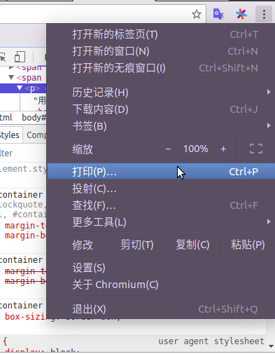
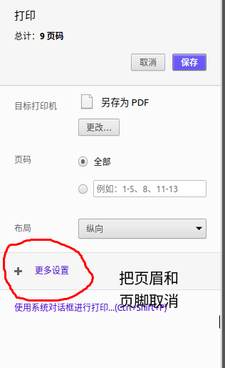

### 转换pdf 时存在的问题
当下免费的 markdown 编辑器非常多,功能齐全也强大,但是在导出 pdf 时往往会遇到很多问题,有可能是国外的编辑器不支持中文,有可能是编辑器的 pdf 转换功能功能并不完整,这种问题在很多编辑器上都会遇到  

### 最好的解决办法  
导出 pdf 的功能各个编辑器效果可能不一样,所以我们可以先使用 markdown 编辑器导出 HTML,基本上所有的编辑器都能实现转换,**导出html时要注意,如果markdown文件中引用了电脑文件上的图片,并且采用相对路径的形式,导出后的html文件应该放在与md文件同一文件夹下,否则图片会无法加载**  
#### 在浏览器中检查和修改HTML  
我们使用浏览器打开生成的 HTML 文件,以 chrome 浏览器为例  
在转 pdf 前,我们可以先看看HTML的显示效果,确定没问题后再进行转换
**如果转换前或转换后觉得字体或排版等效果等不理想,我们可以使用浏览器的开发者工具,审查元素,进行CSS的修改,然后观察页面的效果,打印时打印的将是你当前页面显示的(即修改后的),这就是使用浏览器进行转换的一大优点:它让转换pdf的效果变得更容易控制**  
举例,对于代码块字体大小的调整,我们只要审查元素即可,markdown中代码块字体大小的设置在HTML 的pre标签中,我们只要修改pre标签的font-size 即可

#### 将HTML转换为pdf文件
点击右上角的菜单,选择打印  

对于 chrome 浏览器,在转换前建议将页眉和页脚的选项取消掉,因为在我的电脑中转换时生成了一些乱码  
  

### 其它浏览器  
多数浏览器都支持将当前 HTML 页面转换为 pdf 的功能,但也有默认不支持的,比如 FireFox 浏览器,我们只需要在插件仓库里搜索 pdf 转换插件即可(输入关键字 pdf ,很容易找到)