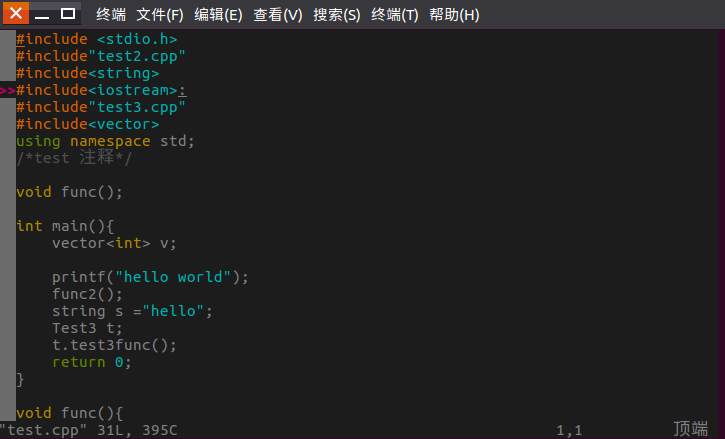

### 介绍
solarized 是vim 的一款背景插件，显示效果好,不伤眼睛，能够在较强的光线下依然能够看清楚。如果碰巧你的座位在窗户旁边，早晨或者傍晚的阳光会让你很困扰，这个配色方案至少让你的眼睛不那么累。  
github 官网: https://github.com/altercation/vim-colors-solarized  
### 安装  
按照官网指示安装即可,官网推荐使用 Pathogen 安装  
    $ cd ~/.vim/bundle
    $ git clone git://github.com/altercation/vim-colors-solarized.git

然后打开 ~/.vimrc文件,修改配置,solarized支持多种主题,这里提供一种黑色背景主题的配置方法
```bash
syntax enable
let g:solarized_termcolors=256
set background=dark
colorscheme solarized  
```
即可,效果如下图:  
  
### 注意事项!
#### 配置内容的位置
**注意,因为我们使用 Pathogen 安装,所以要先启动 Pathogen,才能够启动其下载的配置,所以 solarized 的配置内容要放在 Pathogen 配置内容(如下)的下方,如果不这样做,那么 solarized 不会生效,并会提示你找不到它**
```bash
filetype off
call pathogen#infect()
call pathogen#helptags()
filetype plugin indent on
syntax on
```  
#### let g:solarized_termcolors=256  
官网开始给出的配置是
```bash
syntax enable
set background=dark
colorscheme solarized  
```  
如果仅使用此设置,会发现打开vim后颜色非常难看,原因官网给出,就在**IMPORTANT NOTE FOR TERMINAL USERS:**部分,同时也给出了解决方案,一般来说,在 syntax enable 后添加 let g:solarized_termcolors=256 即可
