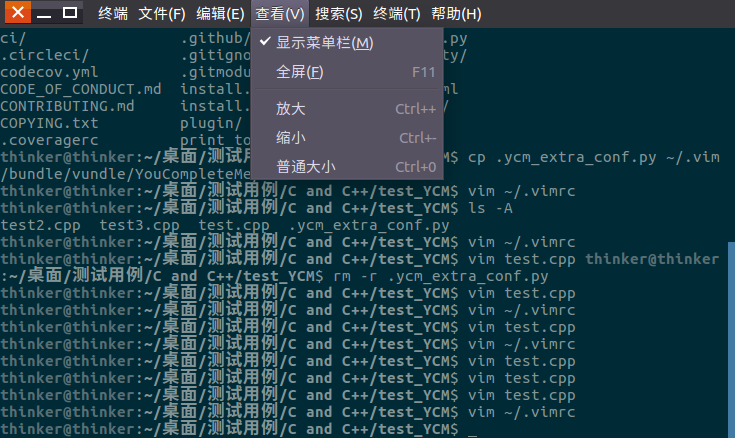
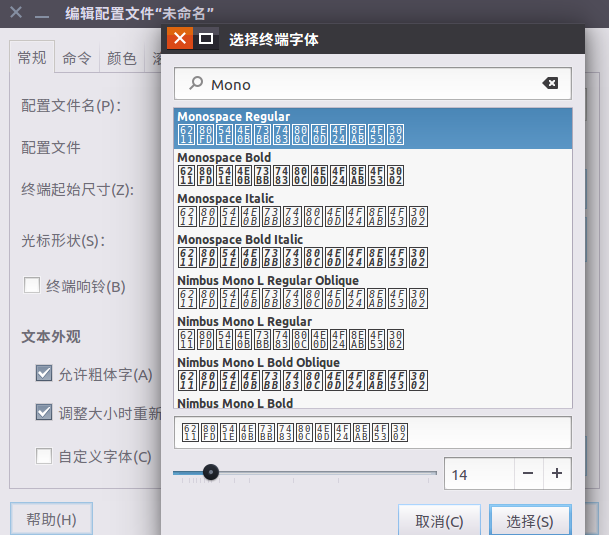

vim 的字体大小是继承终端字体大小设置的,我们要调节 vim 字体大小或种类,需要对终端的字体进行设置,注意改变字体的行距,通常只能通过调节字体的种类来设置,即选择一款合适的字体,具体的行距是不能调整的

对于不同的终端,需要不同的操作
###  Gnome Termianl   
这也是 Ubuntu 的终端, 可以在GUI里进行配置,可视化操作,非常简单  
#### 临时配置,但不推荐
在菜单栏里点击查看,点击放大,就可以放大字体,点击缩小,就可以缩小字体  
效果图如下:  
 
当然也可以用快捷键(菜单栏上有说明) 
Ctrl + '+' 放大字体  
Ctrl + '-' 缩小字体  
要注意的是, **'+' 和 '-'应该用 BACKSPACE 键旁边的按键,此时使用'+'还要按下 SHIFT键 ,数字栏旁边的'+','-'有时不起作用**

#### 更好的选择,替换字体并永久设置大小 
每次进入终端就要按下 Ctrl 来缩放字体是非常痛苦的,更好的做法是在ubuntu终端设置字体并调整其大小,我们可以在终端菜单栏中找到相应选项  
##### 为什么要设置字体  
当我们使用vim编辑文本时,会发现阅读中文字体不太舒服,是因为默认的行距很小.vim并不支持改变行距,它默认使用的是终端的字体设置,因此我们要到终端设置字体  
在ubuntu 16,打开终端>编辑>首选项配置   
  
我们可以设置自定义字体,并设置其默认大小,为了在中英文都能够舒服阅读,我推荐以下几种字体:  
* Monospace Regular  
*  DejaVu Sans Mono Book
*  Liberation Mono Regular  

**字体大小推荐为 14** ,通常默认是12,经过上面的配置,就不用每次打开终端都用快捷键来缩放调整了
