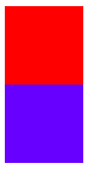
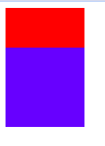

## HTML 3种布局方式  
HTML 布局有三种方式,1为标准流(position),2是浮动(float),3是定位
### position  
通过改变元素的position属性,迫使元素改变正常的标准流,我们可以通过 top,right,bottom,left 改变位置

positon中五个可选参数:static,relative,absolute,fixed,inherit  
##### static
HTML 中默认position为 static,即正常标准流,默认情况下元素有两种: block元素 和 内联元素,每个block元素各占一行,内联元素只有在占满后才会换行,这就是默认情况下元素的布局方式    
##### relative  
使用relative元素仍然处于正常标准流中,但我们可以用 top, right, left,bottom改变它们的位置  
规则: 后写的元素层级大于新写的元素层级,即后写的元素如果在定位时和新写的元素重合会覆盖新写的元素  
举个例子:  假设我们有两个div元素 div1 和 div2,它们宽高为均为100px,div1背景色为 red ,div2背景色为 blue , position均为 relative 那么此时效果如下图:   
   
可见relative并不会改变div是块级元素的特性,此后我们将div2的top 设为 -50px,效果如下图:  
  
div2在原来位置基础上向上移动了50px,且 div2覆盖了div2,可见div2层级是高于div1的  

###### absolute  
用 top, right, left,bottom改变它们的位置,使用 absolute 后会脱离文档流,aboslute参照点是其包含块(包含块是设置了position且position为非static的祖先元素)  
脱离文档流后,假设一个div高度为100px,如果没有设为absolute,其父级body元素高度也为100px,如果div设为 absolute,那么父级元素body高度将变为0,因为脱离了文档流  
两个元素均脱离文档流,将不会有任何嵌套关系,后写元素在重叠部分会覆盖先写元素  
##### fixed  
常用于固定弹窗和对联广告  
元素将固定相对于窗口,不随鼠标滚轮移动而移动,会脱离文档流,不会受制于父元素  
##### inherit  
继承父元素的position,如果父元素为 absolute,那么子元素使用herit 后也为 absolute,两者脱离文档流,则子元素不会和父元素存在关系  
##### z-index  
这个属性用于层级优先级, z-index越大,层级越高,如果一个元素div1的 z-index 大于相邻元素div2,那么div1的子元素不管z-index值为多少,其层级依然会大于div2,父元素z-index总是比子元素小
