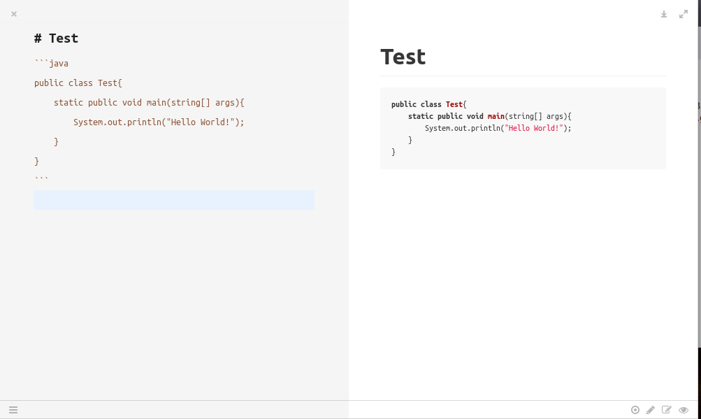
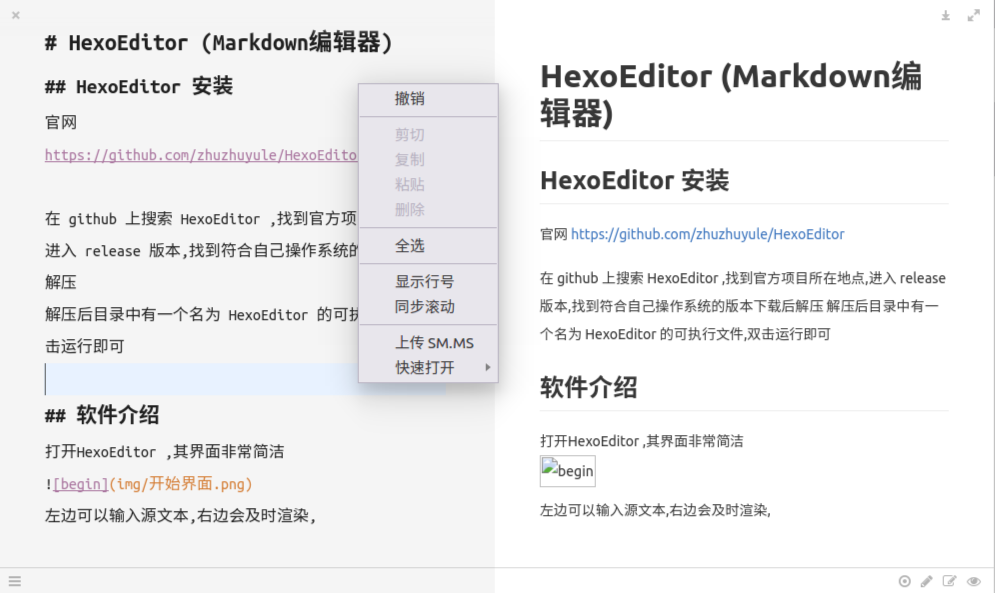
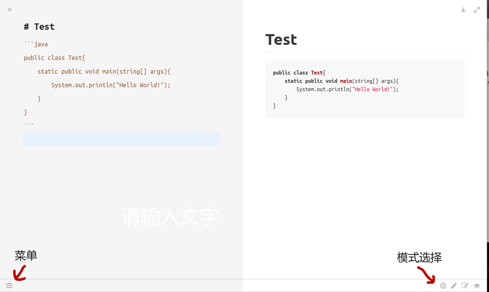
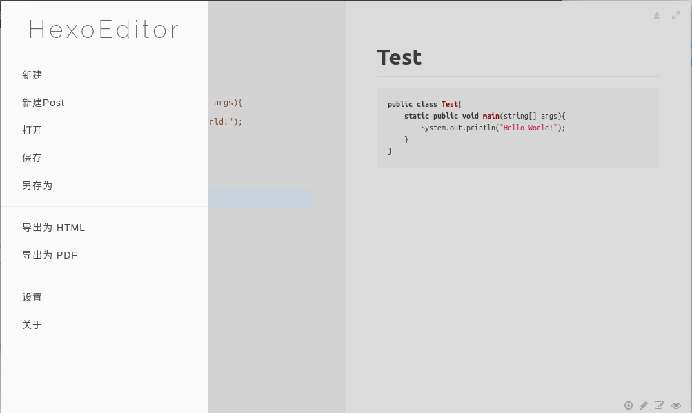
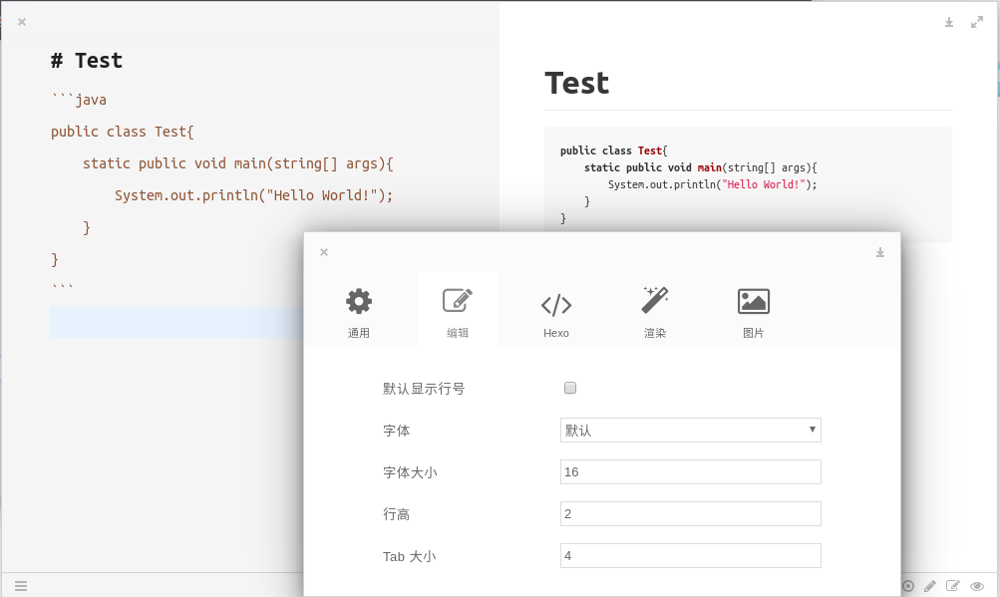
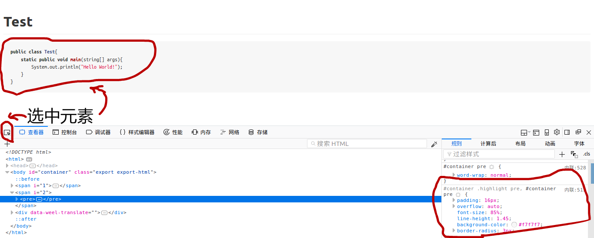
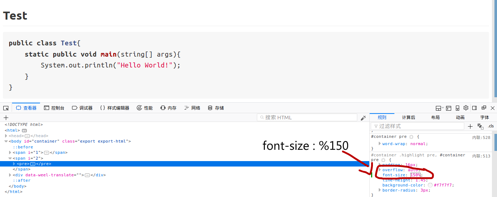
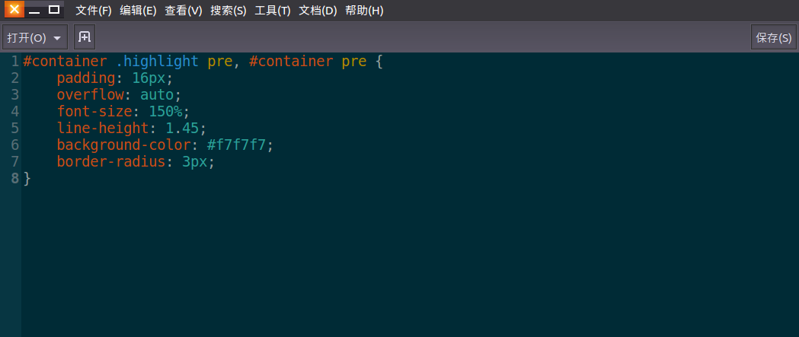
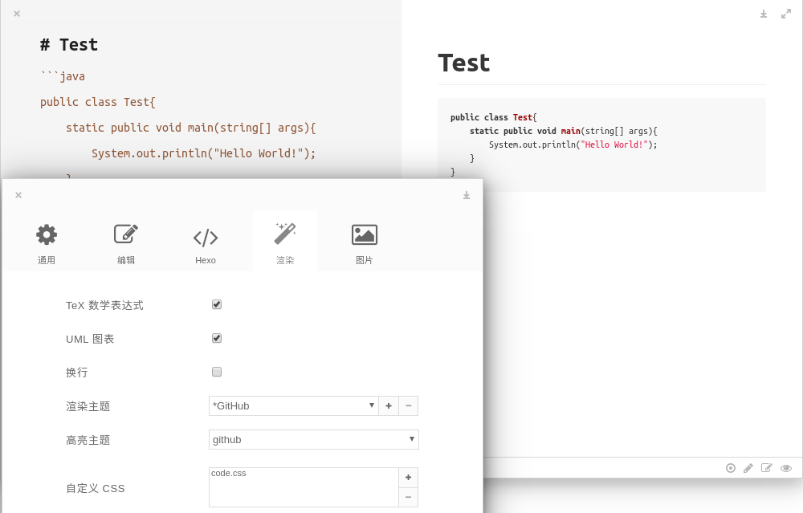
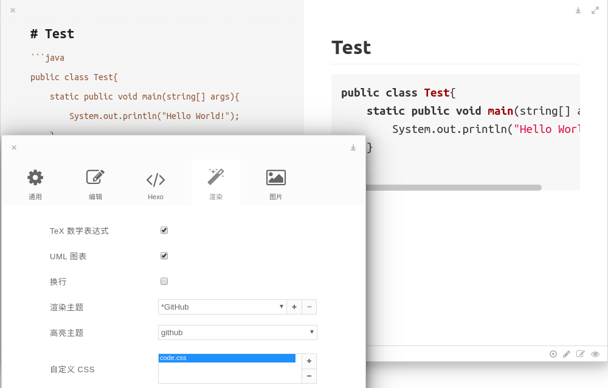

# HexoEditor (Markdown编辑器,另一款几乎功能一样的是Moeditor,功能较少,较稳定,但已长期停更)
## HexoEditor 安装
官网
https://github.com/zhuzhuyule/HexoEditor

在 github 上搜索 HexoEditor (另一款 Moeditor 功能差不多),找到官方项目所在地点,进入 release 版本,找到符合自己操作系统的版本下载后解压
解压后目录中有一个名为 HexoEditor 的可执行文件,双击运行即可

## 软件介绍
#### 界面介绍
打开HexoEditor ,其界面非常简洁  
  
左边可以输入源文本,右边会及时渲染,鼠标点击右键,可以实现左右两个界面在鼠标滑轮转动时"同步滚动"  
  
注意左下角有个不起眼的菜单设置图标,右下角有个阅读模式选择
  
点击菜单效果如下:  
  

### 设置
打开菜单,点击"设置",里面有很多选项,其中编辑选项是对我们源文件界面设置(即我们书写markdown的界面),包括字体  
  

#### 自定义CSS
"渲染"设置用于调整渲染后界面的显示,更多时候我们需要自定义CSS,比如默认的代码块内字体太小了,下面来展示一下如何自定义CSS  
首先我们将其导出为HTML文件,然后用浏览器打开,然后使用"开发者工具",效果如下图:  
  
选中我们的代码块元素,然后尝试修改其中一些CSS,看哪些才是引起字体大小变化的变量,在浏览器开发者模式中,我们可以直接修改变量的,并立即在浏览器中起作用,非常方便  
我们找到了相应的调试位置,调整到我们满意为止:  
  
然后把那部分的的 CSS copy下来,写成一个code.css文件
  
然后在设置的"渲染"处点击"+"号,添加code.css  
这时发现好像添加进来后界面没有立即变化:
  
这时我们再点击一下刚添加进来的文件:  
  
生效了,当然我们还要进一步地测试,尝试其它语言,看代码块如何显示:  
  
调试成功,其它CSS也是用类似方法调试
