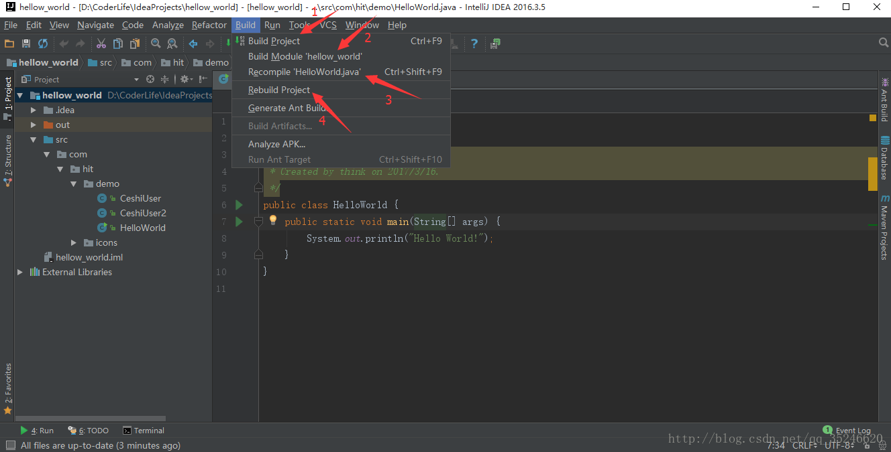
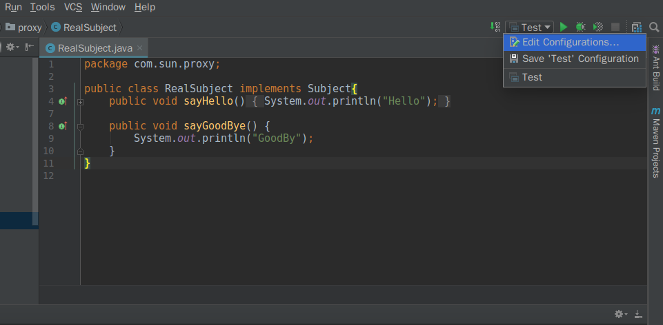
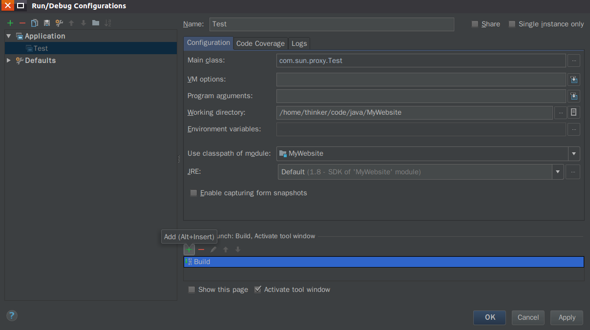

编译的结果:Java的编译会将java编译为class 文件，将非java的文件（一般成为资源文件、比如图片、xml、txt、poperties等文件）原封不动的复制到编译输出目录，并保持源文件夹的目录层次关系。  

IDEA 提供了 Build, ,Rebuild, Recomplier, Run 等编译功能,它们功能类似,但各有不同
(旧版IDEA中Recomplier与功能"Make"类似)  

首先说说这些功能所在的位置,Build, ,Rebuild, Recomplier在菜单栏的 "Build"选项中 ,而Run则在"Run"选项中,如图:   
  
下面说明它们的不同:  
* Build：对选定的目标（Project 或 Module）进行编译，但只编译修改过的文件，没有修改过的文件则不会进行编译。
* Recompile：对选定的目标（Java 类文件），进行强制性编译，不管目标是否是被修改过。 **它可以直接编译修改了的单个java文件,而不用把整个工程都重新编译一遍,能帮助我们大大节省时间**  
* Rebuild：对选定的目标（Project），进行强制性编译，不管目标是否是被修改过，由于 Rebuild 的目标只有 Project，因此每次 Rebuild 花的时间都比较长,  
* Run: 如果源文件已经完成了编译,并且编译后源文件没有修改过,那么每次点击run 都会直接运行编译好的class文件,如果代码编译过后又经过了修改,那么点击Run就会对工程进行重编译(执行Build)  

我们也可以修改点击Run时的编译配置,点击"Edit Configurations"即可,如下图:  
  

