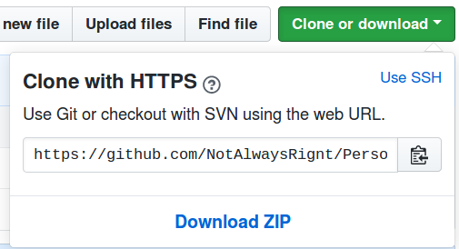
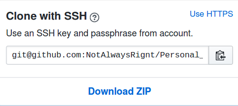

git remote 用于管理远程仓库,比如 github  
添加远程仓库命令:
```bash 
git remote add [-t <branch>] [-m <master>] [-f] [--[no-]tags] [--mirror=<fetch|push>] <name> <url>
```  
具体用法见官网,这里只展示一个最简单示例,也是多数教程使用的:
git remote add origin https &#58;//github.com/XXXXX.git  
或者:  
git remote add origin git@github.com:XXX.git  

以添加 github 为远程库作为例子,
假定使用的是 Linux 操作系统,首先必须确保用户目录下("cd ~ 进入用户目录")存在.ssh文件,并将公钥保存到了
github 的个人账户上(如果公钥设置到个人设置中,则可以在这个帐号下的所有仓库推送内容,也可以将公钥保存在某个仓库中,如此以来只能下这个帐号下某个特定的仓库推送)   

如果没有.ssh文件夹,就自己创建一个,然后使用
```bash
ssh-keygen -t rsa -C "youremail@example.com"
```  
创建一个ssh 


那么如何知道某个仓库的地址? 我们在下载别人的代码时经常会用到按钮 "clone or download",点击后会有 "Download Zip"的选项,如图:  
  

上面有一个可以复制的HTTPS地址,就是我们所需要的地址  
如果我们要使用 SSH 形式,右上角有个 "Use SSH" 按钮,点击后如下图:  
  
这样我们就找到仓库的地址了!