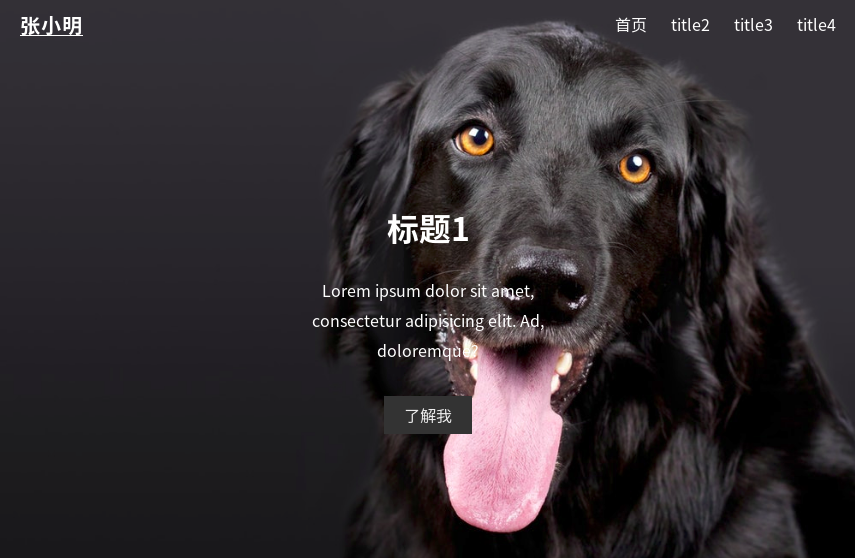
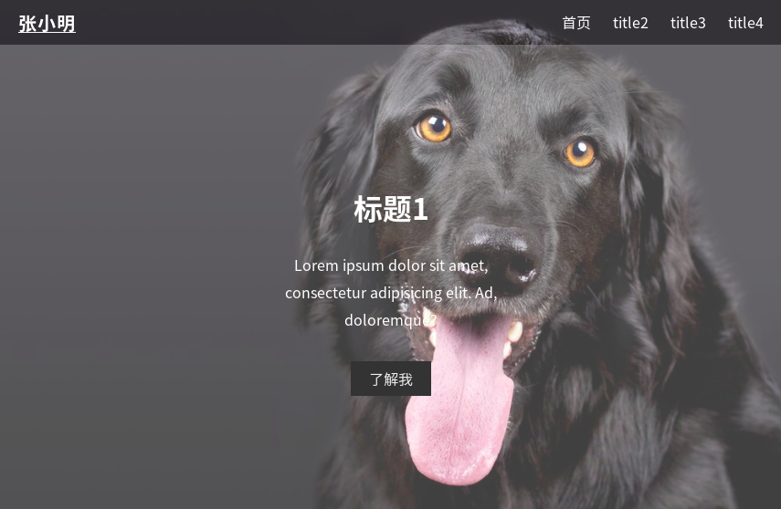

许多颜色繁杂的精致网页都需要漂亮的背景图像支撑,如何将图像正确地放置网页中是我们需要掌握的重要技术,这里将介绍几个CSS图像处理技巧  
### 设置背景颜色
我们在设计布局时,可能会先用背景色填充满一个模块,以便调试模块的位置,最后再用图片替换.  
设置背景颜色可以用background 或 background-color两个属性值
```CSS
background:#fff;
background-color:#fff;
/*或者用rgba*/
background:rgba(255,255,255,0.2);
background-color:rgba(255,255,255,0.3);
/*rgba前三个参数为三原色,第四个参数为透明度(值的范围:0~1)*/
```
background 和 background-color的区别:  
background:#fff;  等价与 background-color:#fff; + background: no-repeat;  
### 背景图片
下面介绍一些图片属性设置的基本技巧  
#### 添加背景图片
background:url( image path )可以添加背景图片  
默认情况下 background:repeat 
#### 背景图像重复
也就是说,如果图片不能占满相应的div,则会重复出现图片,通过  background:no-repeat 可以让图片不重复出现  
#### 使背景图像铺满整个模块
background-size 属性可以设置背景图像占据模块的大小(注意设置背景图像大小不是用 width 和 height ),常用的有
1. background-size:cover;  
图像铺满整个div标签,长度或高度将与模块的长度或高度相等,使得不会留白,但如果图像不能刚好填满,假设高度与模块高度相等,但图像宽度过宽,将导致图像不能全部显示
2. background-size:contain ;
图像一样会铺满整个div,不会留白,但是如果 图像不是刚好填满,空白部分将会用重复的图片填充,相当于background:repeat;
3. background-size: width height  
单位可为像素,可为百分比  
如果只写一个宽度值,则另一个高度值默认为auto  
如 background-size:%60; 等价于 background-size:%60 auto; 

#### 设置模块宽高
图片不一定能总是刚好占满一个div,因为浏览器的屏幕大小也会变化,要让图片适应浏览器大小的变化,可以使用百分比的方式设置模块大小(注意是模块的内容大小,而不是背景大小,背景大小应该用 background-size)  
将高(height)或宽(width)的其中一项设为百分比,另一项设为 auto ,如下:
```CSS
/*宽度占屏幕百分之40,高度会自动调整*/
width:40%;
height:auto;
/*高度占屏幕百分之40,宽度会自动调整*/
width:auto;
height:40%;
```
如果高和宽都设置了具体的值,那随之浏览器大小的变化将导致图片变形  
#### 图像固定
 background-attachment: fixed;  
背景将被固定,不管滑轮怎么滚动,背景始终在浏览器上固定显示,有时这会是一个不错的视觉效果,只要在另一个模块上设置了其它的背景颜色或图片,那么固定的图片滚动到其它模块  
#### 图像居中
background-position: center center;  (background-position其它设置请看文档)
background-position 必须在  background-attachment: fixed;  时才能正常工作  
如果图像过大导致在浏览器界面不能全部显示时,图像会将中间(水平正中,垂直正中)部分显示在浏览器上,这在进行响应式开发时会是一个有用的技巧  
###  背景透明度  
background: transparent;  
transparent 意味透明,
如果设置了一个模块的背景图片,又在子模块里设置了背景色(不透明),那么父模块的图片将被背景色掩盖,如果不想让子模块的背景色影响图片,我们需要将背景色设为透明 
##### 使用rgba控制透明度,使背景色与图像结合  
调节背景色透明度并与图片相配合有时可以达到美化图片的效果:
如下图:  
  
现在我们在其中一个模块(导航栏下面部分)设置
```CSS
#banner {
/*白色,透明度为0.25*/
	background: rgba(255,255,255,0.25); 
	height: 700px;
}
```
效果如下:  
