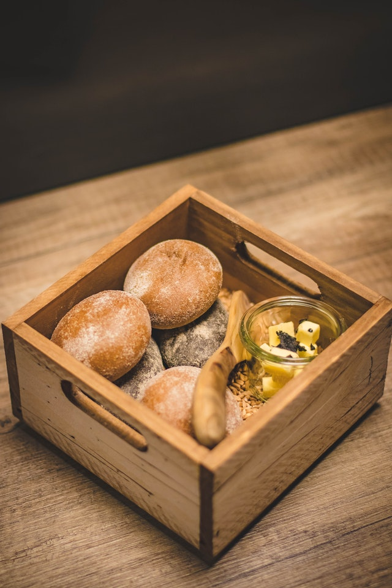
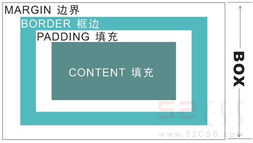
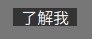

对于CSS中的盒子模型,我们完全可以用现实中的盒子来理解其概念
  
如上面的木盒子,木盒子边框就是border,注意盒子边框是有厚度的,厚度的值就是border的值  
如果有多个木盒子,盒子与盒子的距离就叫 margin(外边距)  
盒子内部的蘑菇就是盒子里的内容,即元素(比如文字),木盒子里的元素是不规则的图形,在盒模型中,元素块被限制在一个矩形中.  
元素不一定填满整个盒子,就像月饼盒里的月饼往往不是完全充满整个盒子,这样拿到拿不出来,盒子边框与元素的距离称为padding(内边距)
下图中,border的值为0px;  
  
我们再看一个border不为0px的图:  

**在HTML中,所有元素都对应着一个盒子模型**  
### margin
margin:0 auto;   
上面的意思是 margin-left 和 margin-right 为 auto,此时整个块将居中
##### margin折叠
什么是margin折叠：当两个或更多个垂直边距相遇时，它们将形成一个外边距。这个外边距的高度等于两个发生叠加的外边距的高度中的较大者。  我们在操纵嵌套元素的位置时可能会遇到这些问题,这里不展开讲
### border
button 元素就会自带 border,我们在设置 background 为深色时会发现,按钮边缘还有一些亮色  

设置 border:none;  

### background与上面几种距离的关系  
我们这里只说火狐,谷歌浏览器的标准:
火狐,谷歌浏览器中,background的范围为 content + padding + border