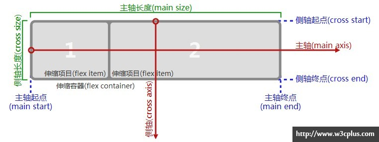

## 盒模型的问题
传统的布局思路是在 css 的盒模型基础上,依赖 display 属性 + position属性 + float属性。它对于那些特殊布局非常不方便，比如，垂直居中就不容易实现。

## flex是什么
Flex 是 Flexible Box 的缩写，意为"弹性布局"，用来为盒状模型提供最大的灵活性。  
  
概念很多,我们在使用这个模型时,要先把目光放在两个概念上:**主轴** 和 **侧轴**  
flex-box 的诸多属性基本都是围绕着这两个概念展开的.  

首先要明确,主轴和侧轴有方向,且我们可以设置它们的方向,但是不管怎么设置,它们始终都是垂直的  

在 flex-box 模型中,假设存在多个模块,那么每一个模块的位置都将由它们在 主轴 和 侧轴 两个方向上的分布特性.牢牢把握这个思路,调节模块在这两个轴方向上的属性.就可以控制模块的位置关系了.