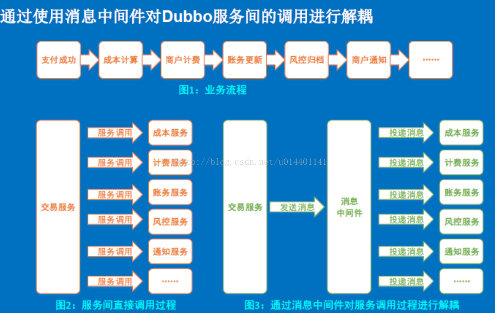

### 什么是消息中间件
简单地理解:消息中间件是一种软件,它相当于不同进程间数据传输的中转站.

### 为什么要消息中间件
　　业务逻辑的解耦,并可以在分布式环境下扩展进程间的通信。  
　　想象一个场景,对于一个博客网站,用户向网站上传了一篇图文并茂的文章.服务器拿到这个文章后假设要对这个文章进行响应的处理(比如图片一般不会直接存到数据库中,而是另作存储,文章中仅保留图片的url),另外还要作响应的日志记录.  
　　显然,当服务器收到文章内容后,就应该返回用户上传成功,而不是在等所有的处理完成后,这时我们的消息中间件就可以派上用场,我们可以把日志记录,文章内容处理等功能作为另一个应用程序,当用户上传文章成功后,服务器先把用户文章内容发给消息中间件,然后就返回给客户上传成功的信息.至于日志记录,文章处理程序,它们会到消息中间件里去取数据,然后完成,这样就能及时处理业务了  
　　上面是一个简单的例子，我们再看一张消息中间件的图片示例,就能知道它是如何解耦的.  
  
### Java 消息中间件　　
#### JMS(Java Message Service)  
　　JMS 是 Java 消息中间件的一套 API 规范,注意它只是一个规范,比如规定了接口的命名,但并没有做相应的实现.  
　　目前实现了 JMS 的框架有很多,比如 ActiveMQ、RocketMQ ...
　　在 JMS 规范中,发送数据给中间件的是生产者,从中间件获取数据的是消费者.指定中间件的url(ip+ 端口)和以及队列(Queue)或主题(Topic)的名字,生产者将数据发送到这个url 中, JMS 应用程序就可以接收数据并保存起来,在消费者应用程序中,只要知道这个url以及名字,就可以从中获取信息.即是说,url和名字可以唯一辨识中间件中数据的位置  