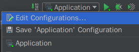
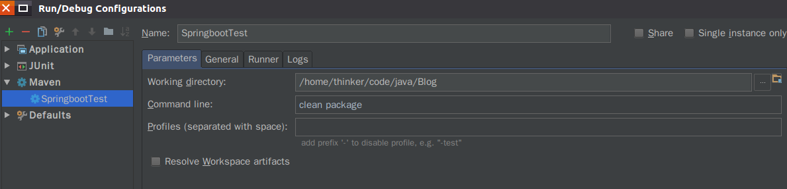
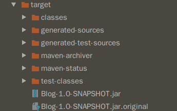

### 打包项目并直接运行
Spingboot内部集成了 Tomcat,性能会稍微差一点,但也可以满足小网站的需求,我们可以直接将项目打包成jar包后在命令行中运行  
在IDEA的打包方法,网上有很多,但非常复杂,其实 Maven 自己就有打包功能,非常简单好用,在IDEA中使用方法如下图:  
招待 Edit Configuration:  
  
在 Maven 选项下,点击 "+" 号,创建一个配置,在 "Command line" 中输入 clean package(清除原来的包,重新打包),请确保已经在pom.xml 中安装了 springboot-maven-margin 拓展 dependency  

打包后会生成两个 jar 包,其中一个名字中带有original,是可以解压的,另一个是可执行jar
  
进入jar包所在目录,在命令行中输入
```bash
java -jar Blog-1.0-SNAPSHOT.jar 
```  
Blog-1.0-SNAPSHOT.jar 是打包后 jar 包的名字,这样程序就运行起来了!
