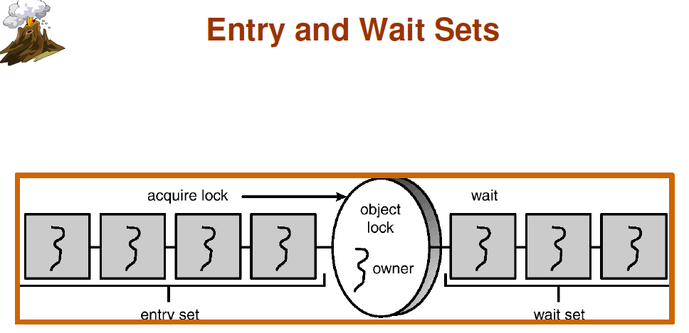

参考文章:
http://blog.csdn.net/zhangzhaokun/article/details/6395557

每个 Java 对象都会有**一个** Monitor锁,这个锁是实现同步的关键所在,对于被sychronized修饰的对象,在**某一个时刻只能有一个线程**拥有Monitor锁  

Java会为每个对象维护两个数据结构 Entry Set 和 Wait Set,  示意图如下：
  

### Entry Set
Entry Set 中放置的是等待获取这个 Monitor 锁的线程,一旦正在占用 Monitor 锁的 Thread 将锁释放,Entry Set 中的线程就会去争抢它.    
但是只能有**任意的一个** Thread 能取得该锁，而其他线程依然在entry set中等待下次来抢占到锁之后再执行。
### Wait Set　
WaitSet 存储的是**曾经获得过锁**,但是调用了 **wait()** 将锁释放的线程.   

在wait set区域的线程获得Notify/notifyAll通知的时候，随机的一个Thread（Notify）或者是全部的Thread（NotifyALL）从Object Lock的wait set区域进入了entry set中,即调用 Notify/notifyAll 后线程还需要去抢占锁.  

### 注意事项
使用锁会降低效率,甚至造成死锁,因此要谨慎使用