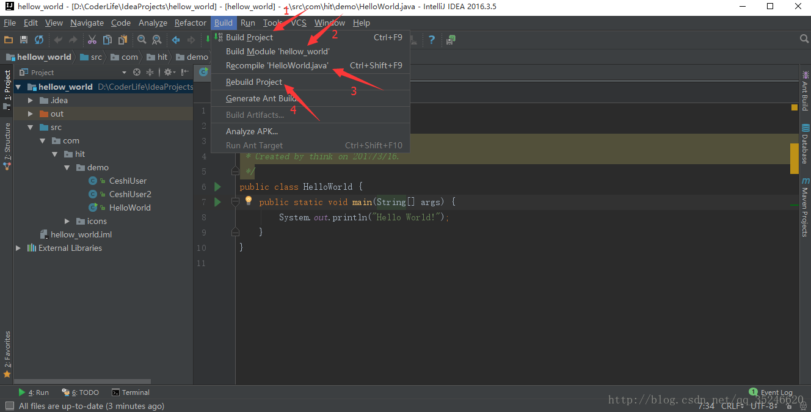
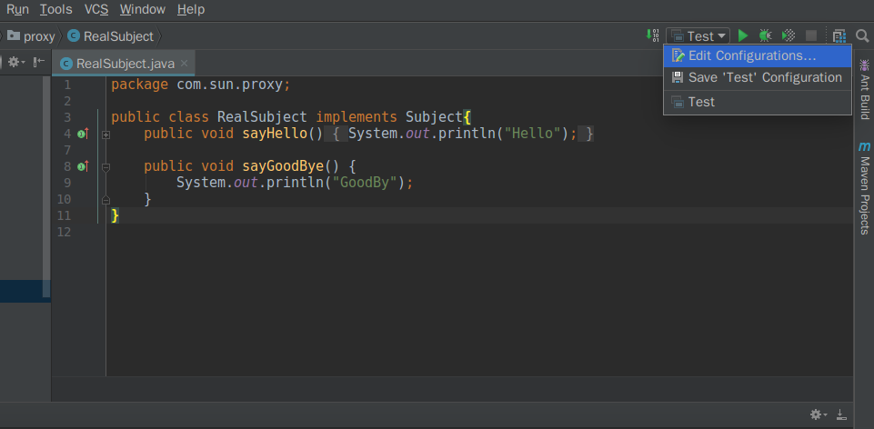
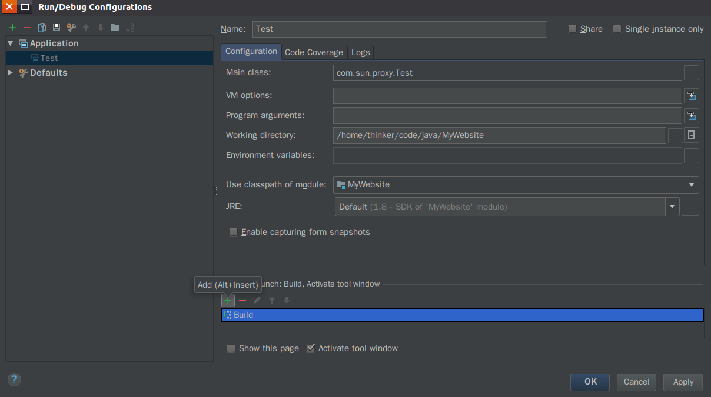

编译的结果:Java的编译会将java编译为class 文件，将非java的文件（一般成为资源文件、比如图片、xml、txt、poperties等文件）原封不动的复制到编译输出目录，并保持源文件夹的目录层次关系。  

IDEA 提供了 Build, ,Rebuild, Recomplier, Run ,Debug(严格来说 Run 和 Debug包括了编译,他们的本质是 Build )等编译功能,它们功能类似,但各有不同
(旧版IDEA中Recomplier与功能"Make"类似)  

首先说说这些功能所在的位置,Build, ,Rebuild, Recomplier在菜单栏的 "Build"选项中 ,而Run则在"Run"选项中,如图:   
  
下面说明它们的不同:  
* Build：对选定的目标（Project 或 Module）进行编译，但只编译修改过的文件，没有修改过的文件则不会进行编译。
* Recompile：对选定的目标（单个Java 类文件），进行强制性编译，不管目标是否是被修改过. 
* Rebuild：对选定的目标（Project），进行强制性编译，不管目标是否是被修改过，由于 Rebuild 的目标只有 Project，因此每次 Rebuild 花的时间都比较长,  
* Run(Debug): 与前面不同之处在于编译完后还会运行如果源文件已经完成了编译,并且编译后源文件没有修改过,那么每次点击run 都会直接运行编译好的 class 文件,如果代码编译过后又经过了修改,那么点击 Run和Debug 就会对工程进行重编译(执行Build)  

**从上面的解释可以看出,正常情况下,我们只要使用 debug 或 run 即可让程序执行编译并运行,IDEA 会自动做编译上的优化,比如只编译改动的部分,第一次编译可能会耗时比较长,因为所有文件都要被编译一次,之后编译耗时就会短一些(只编译改动部分)**  

我们也可以修改点击Run时的编译配置,点击"Edit Configurations"即可,如下图:  
  

