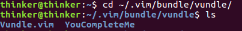
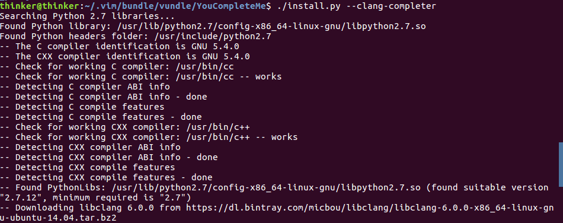
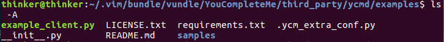
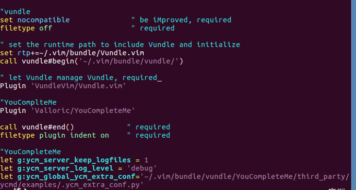

### YouComplteMe 是什么
YouComplteMe,简称 YCM,是vim的一款代码补全插件,如果想用vim 来作IDE,安装这款插件是很有必要的   
官网: https://github.com/Valloric/YouCompleteMe
安装 YCM 并不容易,推荐一篇不错的教程:  
https://blog.csdn.net/mr_zing/article/details/44263385  

### 安装所需环境
#### 确认vim 版本以及安装好python
> Make sure you have Vim 7.4.1578 with Python 2 or Python 3 support. Ubuntu 16.04 and later have a Vim that's recent enough.

检查 vim 版本,并确认已经安装好 python2 或 python3
(如果安装过程中提示 python 有问题,且没有安装python2,则最好确保安装了python2)  
  
```bash
sudo apt-get install python-dev python3-dev
```

#### 安装好Cmake  
YCM 是一款带有编译功能的插件,我们需要确保已经安装好 Cmake
```bash
sudo apt-get install build-essential cmake
```

如果是 ubuntu 14.04 版本,使用如下命令
```bash
sudo apt-get install build-essential cmake3
```

#### 安装好 LLVM-Clang 3.3 和 Clang 标准库
YCM 作C语言家族的语义分析和补全需要 clang 库的支持,这一步不可少,clang 是一款非常优秀的编译器,安装它也是很有必要的!   
clang 的安装需要花费不少的时间,安装流程这里不再展开  

### 使用 Vundle 安装 YCM
使用 vundle 进行安装,在 .vimrc 中的 vundle 配置部分添加  
Plugin 'Valloric/YouCompleteMe'  
因为插件在github 中,使用上面语法,然后终端输入 vim,回车,然后输入 :PluginInstall 
就会开始 YouCompleteMe 的安装   
  
这个过程会比较长,在 'Valloric/YouCompleteMe' 旁边没有出现 + 号时不要关闭vim  

安装成功后如下:  
  

安装完毕后,YCM还是不能正常使用的,使用 vim 时会出现如下提示:
The ycmd server SHUT DOWN (restart with :YcmRestartServer) ...(省略)
我们使用 (restart with :YcmRestartServer) 会发现问题无法解决,因为我们还没有完全配置完毕  

解决方法:
首先进入 ~/.vimrc,添加以下两行,这样是为了能查看错误日志
```bash
let g:ycm_server_keep_logfiles = 1
let g:ycm_server_log_level = 'debug'
```

**接下来是安装的一个重要环节**
我们在 .vimrc 的配置中设置了 call vundle#begin('~/.vim/bundle/vundle/')
因此 YCM 安装到了 ~/.vim/bundle/vundle/ 下,进入查看  
  
可以看见 ~/.vim/bundle/vundle/ 中确实有 YouCompleteMe 这个目录 
进入 YouCompleteMe 目录  
**ls 后看见这个目录下有一个 install.py 文件,我们要使用它来完成YCM安装**
根据官网的说明  
要获得 C语言家族的自动补全功能,同时支持语义分析,使用如下命令(其它语言的自动补全安装请参见官网说明)
```bash
./install.py --clang-completer
```
这样安装的YCM 具有 C语言家族的语义支持功能    
如果不想要语义支持,则使用如下命令  
```bash
./install.py
```

安装需要一段时间,如下图:  


#### 设置 .ycm_extra_conf.py,非常重要的一步!
安装完成后,我们打开 vim,就可以看见 The ycmd server SHUT DOWN (restart with :YcmRestartServer) 的错误提示没有了,并且也支持基本的补全功能,但还是没有完成安装,启动 vim 时,会有如下提示:
No .ycm_extra_conf.py file ...(省略)  
这是一个配置文件,要使用完整的 YCM 补全功能我们需要在 .vimrc 中指定它所处的路径

我们可以自己编写这个文件,但这样是比较麻烦的,安装好 YCM 好,YCM 提供了一个足够满足需求的 .ycm_extra_conf.py
这个文件在 YouCompleteMe 插件目录里,找到 YouCompleteMe 目录,因为安装 vundle 时我的 .vimrc 设置了  
call vundle#begin('~/.vim/bundle/vundle/')  ,所以 YouCompleteMe 在 ~/.vim/bundle/vundle/ 下

继续进入目录,.ycm_extra_conf.py 就放在 YouCompleteMe/third_party/ycmd/examples 下,这是个隐藏文件,我们可以用 ls -A 命令查看它,如下图


找到这个文件后,进入 .vimrc 中设置 ycm_global_ycm_extra_conf 变量:  
```bash
let g:ycm_global_ycm_extra_conf='~/.vim/bundle/vundle/YouCompleteMe/third_party/ycmd/examples/.ycm_extra_conf.py'
```

  

至此 YouCompleteMe 就已经初步安装完毕了!

#### 关于 .ycm_extra_conf.py file
这个文件的内容决定了我们能不能很好地使用 YCM 的语义分析补全功能 
除了上面提到的 .ycm_extra_conf.py, 我们可以在 YouCompleteMe/third_party/ycmd/cpp/ycm 下找到这个文件,只不过这个文件还需要修改才能满足我们的需求,官网中 **C-family Semantic Completion** 章节的 **Option 2: Provide the flags manually** 部分就提供了
.ycm_extra_conf.py 的示例链接,我们也可以到网上去查找一些有用的配置文件

如果要自己配置这个py文件,不妨把官网的示例文件下载下来我们要让 YCM 去寻找补全的片段,关键就在于 flags 的键值 
```py
    return {
    'flags': final_flags,
    'do_cache': True
    }
```
我们需要在列表中添加开头flags变量里添加:
'-isystem',
'/usr/include',
'-isystem',
'/usr/include/c++/4.9.2',
'-isystem',
'/usr/include',
'/usr/include/x86_64-linux-gnu/c++',
注意 '/usr/include/c++/4.9.2' 中 c++里面


#### 有可能需要的步骤   
.ycm_extra_conf.py 中有以下一句:  
import ycm_core  
ycm_core 可能要我们去编译完成
随便在某一个路径下创建一个 ycm_build 目录,为了便于管理我创建在了 ~/.vim/bundle/vundle/YouCompleteMe 下  

执行编译命令 
```bash
cmake -G "Unix Makefiles" -DUSE_SYSTEM_LIBclang=ON -DEXTERNAL_LIBCLANG_PATH=/usr/local/lib/libclang.so . ~/.vim/bundle/vundle/YouCompleteMe/third_party/ycmd/cpp
```

执行前确保 /usr/local/lib/ 确实有 libclang.so 文件(如果成功安装 clang 就会有),  
~/.vim/bundle/vundle/YouCompleteMe/third_party/ycmd/cpp 中的 ~/.vim/bundle/vundle 是在.vimrc中配置时设定的: vundle#begin('~/.vim/bundle/vundle/')  
成功安装 YCM 后, ~/.vim/bundle/vundle/ 下就会有 YouCompleteMe 目录,我们就可以找到 YouCompleteMe/third_party/ycmd/cpp  这个路径

cmake执行完毕后,当前 ycm_build 中会产生很多个文件,其中有个文件就是 Makefile  
执行  make ycm_core   等待编译完成
