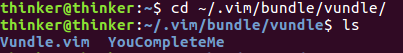

### YouComplteMe 是什么
YouComplteMe,简称YCM,是vim的一款代码补全插件,如果想用vim 来作IDE,安装这款插件是很有必要的  

### 安装所需环境
#### 确认vim 版本以及安装好python
> Make sure you have Vim 7.4.1578 with Python 2 or Python 3 support. Ubuntu 16.04 and later have a Vim that's recent enough.

检查 vim 版本,并确认已经安装好 python2 或 python3  
  
```bash
sudo apt-get install python-dev python3-dev
```

#### 安装好Cmake  
YCM 是一款带有编译功能的插件,我们需要确保已经安装好 Cmake
```bash
sudo apt-get install build-essential cmake
```

如果是 ubuntu 14.04 版本,使用如下命令
```bash
sudo apt-get install build-essential cmake3
```

(不确定是否需要)安装好clang

### 使用 Vundle 安装 YCM
使用 vundle 进行安装,在 .vimrc 中的 vundle 配置部分添加  
Plugin 'Valloric/YouCompleteMe'  
因为插件在github 中,使用上面语法,然后终端输入 vim,回车,然后输入 :PluginInstall 
就会开始 YouCompleteMe 的安装   
  
这个过程会比较长,在 'Valloric/YouCompleteMe' 旁边没有出现 + 号时不要关闭vim  

安装成功后如下:
  

安装完毕后,YCM还是不能正常使用的,使用 vim 时会出现如下提示:
The ycmd server SHUT DOWN (restart with :YcmRestartServer) ...(省略)
我们使用 (restart with :YcmRestartServer) 会发现问题无法解决,因为我们还没有完全配置完毕  

解决方法:
首先进入 ~/.vimrc,添加以下两行,这样是为了能查看错误日志
```bash
let g:ycm_server_keep_logfiles = 1
let g:ycm_server_log_level = 'debug'
```

**接下来是安装的一个重要环节**
我们在 .vimrc 的配置中设置了 call vundle#begin('~/.vim/bundle/vundle/')
因此 YCM 安装到了 ~/.vim/bundle/vundle/ 下,进入查看  
  
可以看见 ~/.vim/bundle/vundle/ 中确实有 YouCompleteMe 这个目录 
进入 YouCompleteMe 目录  
**ls 后看见这个目录下有一个 install.py 文件,我们要使用它来完成YCM安装**
根据官网的说明  
```bash
./install.py --clang-completer
```
这样安装的YCM 具有 C语言家族的语义支持功能    
如果不想要语义支持,则使用如下命令  
```bash
./install.py
```

安装需要一段时间,如下图:


安装完成后,我们打开 vim,就可以看见 The ycmd server SHUT DOWN (restart with :YcmRestartServer) 的错误提示没有了,并且也支持基本的补全功能,但还是没有完成安装,启动 vim 时,会有如下提示:
No .ycm_extra_conf.py file ...(省略)  
这是一个配置文件,要使用完整的 YCM 功能我们需要在 .vimrc 中指定它所处的路径

这个文件在 YouCompleteMe 插件目录里,找到 YouCompleteMe 目录,因为安装 vundle 时我的 .vimrc 设置了  
call vundle#begin('~/.vim/bundle/vundle/')  ,所以 YouCompleteMe 在 ~/.vim/bundle/vundle/ 下

继续进入目录,.ycm_extra_conf.py 就放在 YouCompleteMe/third_party/ycmd/cpp/ycm/ 下,这是个隐藏文件,我们可以用 ls -A 命令查看它,如下图


找到这个文件后,进入 .vimrc 中设置 ycm_global_ycm_extra_conf 变量:  
```bash
let g:ycm_global_ycm_extra_conf='~/.vim/bundle/vundle/YouCompleteMe/third_party/ycmd/cpp/ycm/.ycm_extra_conf.py'
```

  

至此 YouCompleteMe 就已经初步安装完毕了!
