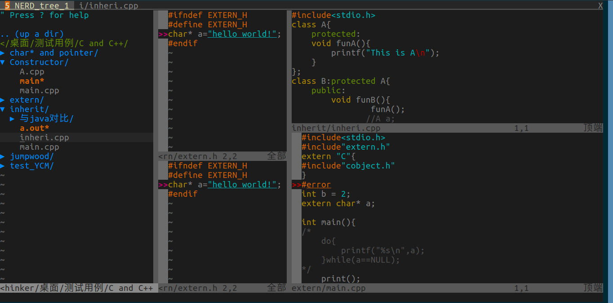

参考文章: https://blog.csdn.net/MDL13412/article/details/48768143
Vim 中的 window 和 tab 非常具有迷惑性，跟我们平时所说的 “窗口” 和 “标签页” ，是完全不同的两个概念，请看 vimdoc 给出的定义:  
```
A buffer is the in-memory text of a file.
A window is a viewport on a buffer.
A tab page is a collection of windows.
```  

简单来说就是:
* buffer 可以看做是内存中的文本文件，在没写到磁盘上时，所有的修改都发生在内存中;
* window 用来显示 buffer，同一个 buffer 可以被多个 window 显示(一个 window 只能显示一个 buffer),我们用vim进行分窗,一个窗口就是一个window
* tab page 包含了一系列的 window，其实叫 layout 更合适,一个标签页可以有一个window,比如我们浏览器里面,一般新开一个窗口上方就会多一个标签,一个标签对应一个窗口,不过 vim 中,一个标签页下的window可以再进行分窗操作,即一个tab下可以有多个window

一个示例图片,该窗口进行了分窗操作,同时观察上方,它开启了两个标签页: NERD_tree_1 和 i/inheri.cpp


官网给的概念图:  

