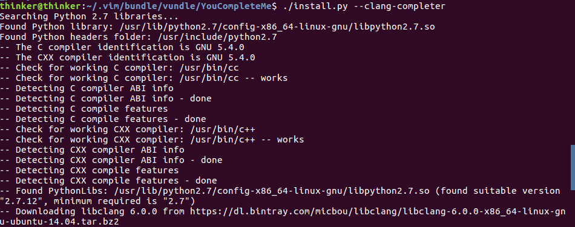

### YouComplteMe 是什么
YouComplteMe,简称 YCM,是vim的一款代码补全插件,如果想用vim 来作IDE,安装这款插件是很有必要的   
官网: https://github.com/Valloric/YouCompleteMe
安装 YCM 并不容易,推荐一篇不错的教程:  
https://blog.csdn.net/mr_zing/article/details/44263385  

### 安装所需环境
#### 确认vim 版本以及安装好python
> Make sure you have Vim 7.4.1578 with Python 2 or Python 3 support. Ubuntu 16.04 and later have a Vim that's recent enough.

检查 vim 版本,并确认已经安装好 python2 或 python3
(如果安装过程中提示 python 有问题,且没有安装python2,则最好确保安装了python2)  
  
```bash
sudo apt-get install python-dev python3-dev
```

#### 安装好Cmake  
YCM 是一款带有编译功能的插件,我们需要确保已经安装好 Cmake
```bash
sudo apt-get install build-essential cmake
```

如果是 ubuntu 14.04 版本,使用如下命令
```bash
sudo apt-get install build-essential cmake3
```

#### 安装好 LLVM-Clang 3.3 和 Clang 标准库(可选)
YCM 要进行C语言家族的语义分析和补全需要 clang 库的支持,这一步不可少,clang 是一款非常优秀的编译器,安装它也是很有必要的!
如果系统已经安装好了 clang,那么 YCM 可以使用系统的 clang 来进行语义分析,也可以在安装过程中让 YCM 自己去下载 clang(下面会讲) ,不过YCM下载的 clang 仅是为了 YCM 作语义分析用,并不是下载完整的clang     
clang 的安装需要花费不少的时间,安装流程这里不再展开  

### 使用 Vundle 安装 YCM
使用 vundle 进行安装,在 .vimrc 中的 vundle 配置部分添加  
Plugin 'Valloric/YouCompleteMe'  
因为插件在github 中,使用上面语法,然后终端输入 vim,回车,然后输入 :PluginInstall 
就会开始 YouCompleteMe 的安装   
  
这个过程会比较长,在 'Valloric/YouCompleteMe' 旁边没有出现 + 号时不要关闭vim  

安装成功后如下:  
  

安装完毕后,YCM还是不能正常使用的,使用 vim 时会出现如下提示:
The ycmd server SHUT DOWN (restart with :YcmRestartServer) ...(省略)
我们使用 (restart with :YcmRestartServer) 会发现问题无法解决,因为我们还没有完全配置完毕  

解决方法:
首先进入 ~/.vimrc,添加以下两行,这样是为了能查看错误日志
```bash
let g:ycm_server_keep_logfiles = 1
let g:ycm_server_log_level = 'debug'
```

**当使用vundle的:IntallPlugin!更新插件时,有时也会出现The ycmd server SHUT DOWN (restart with :YcmRestartServer)的错误,这时候的解决办法**
```bash
# 进入.vim的YouCompleteMe所在目录
# 使用的是vim时,这里我是用vundle安装的,而vundle又是用pathogen安装的
~/.vim/bundle/vundle/YouCompleteMe 

# 使用的是neovim 时
cd ~/.local/share/nvim/site/plugged/YouCompleteMe 

# 执行install.py
./install.py

```

**接下来是安装的一个重要环节**
我们在 .vimrc 的配置中设置了 call vundle#begin('~/.vim/bundle/vundle/')
因此 YCM 安装到了 ~/.vim/bundle/vundle/ 下,进入查看  
  
可以看见 ~/.vim/bundle/vundle/ 中确实有 YouCompleteMe 这个目录 
进入 YouCompleteMe 目录  
**ls 后看见这个目录下有一个 install.py 文件,我们要使用它来完成YCM安装**
根据官网的说明  
要获得 C语言家族的自动补全功能,同时支持语义分析,使用如下命令(其它语言如java,go等的自动补全安装请参见官网说明)
```bash
./install.py --clang-completer
```
上述命令中 YCM 会自己去下载供自己使用的 clang ,如果系统已经安装好了 clang,则可用以下命令  
```bash
./install.sh --clang-completer --system-libclang
```
这样安装的YCM 具有 C语言家族的语义分析功能    
如果不想要语义分析功能(不建议),则使用如下命令  
```bash
./install.py
```

安装需要一段时间,如下图:  


#### 设置 .ycm_extra_conf.py,非常重要的一步!
安装完成后,我们打开 vim,就可以看见 The ycmd server SHUT DOWN (restart with :YcmRestartServer) 的错误提示没有了,并且也支持基本的补全功能,但还是没有完成安装,启动 vim 时,会有如下提示:
`No .ycm_extra_conf.py file ...(省略)`  
这是一个配置文件,要使用的 YCM 语义补全功能我们必须指定它的路径,可在 .vimrc 中全局设置  

##### 使用 .ycm_extra_conf.py
对于复杂的项目, YCM 得知道 flag 才知道这个目录怎么组织的,YCM 可不会聪明到我们从别的目录引入了头文件,要知道 flag 信息,就需要`.ycm_extra_conf.py`,如果没有这个文件,那么即使是标准库的头文件,比如 `map`,`vector`,YCM也无法帮我们补全

**具体使用`.ycm_extra_conf.py`的写法参考官方文档**,它给了一个很简单的例子
一个示例`.ycm_extra_conf.py` 就放在`YouCompleteMe/third_party/ycmd/examples`下,这是个隐藏文件,我们可以用 ls -A 命令查看它,如下图  


我们可以根据它来改写,实践证明仅仅是它也勉强能用,起码标准头文件能补全了,不过还是建议重写个并修改一下,主要是修改`flags`,我们可以模仿`flags`的`-isystem`指向目录根据自己操作系统实际情况修改,然后进入`.vimrc`中设置`ycm_global_ycm_extra_conf`变量:  
```bash
#注意路径要根据实际路径修改
let g:ycm_global_ycm_extra_conf='~/.vim/bundle/vundle/YouCompleteMe/third_party/ycmd/examples/.ycm_extra_conf.py'
```
  

至此 YouCompleteMe 就已经初步安装完毕了!
除了上面提到的 .ycm_extra_conf.py, 我们可以在 YouCompleteMe/third_party/ycmd/cpp/ycm 下找到这个文件,只不过这个文件还需要修改才能满足我们的需求,官网中 **C-family Semantic Completion** 章节的 **Option 2: Provide the flags manually** 部分也提供了
.ycm_extra_conf.py 的示例链接,可以下载下来并修改,我们还可以到网上去查找一些有用的配置文件

如果要自己配置这个py文件,不妨把官网的示例文件copy下来,在flags(一个[]变量)里面添加如下内容(系统文件用-isyetem，第三方文件用 -I)：
```py
'-isystem',  
'/usr/include',  
'-isystem',  
'/usr/include/c++/',  
'-isystem',  
'/usr/include/x86_64-linux-gnu/c++' 
```
如果要让其对C++标准库补全生效，还要把配置文件中的这几行（从try到pass这4行）注释掉：
```python
# NOTE: This is just for YouCompleteMe; it's highly likely that your project  
# does NOT need to remove the stdlib flag. DO NOT USE THIS IN YOUR  
# ycm_extra_conf IF YOU'RE NOT 100% SURE YOU NEED IT.  
try:  
  final_flags.remove( '-stdlib=libc++' )  
except ValueError:  
  pass 
```

 最好先把YCM作者提供的模板备份一下再做改动，然后将改动好的文件就放在原来的位置，作为全局的ycm_extra_conf.py，这样平时写个小Cpp的程序就不需要再单独创建一个。要使之生效，需要在.vimrc里面设置YCM相应的选项，此选项会在下面配置部分详细说明。对于特定的工程，将其拷贝到工程文件夹下，然后在这基础上再修改。不用担心工程文件夹下的`.ycm_extra_conf.py`会和全局的冲突，因为开启vim之后，ycm会先在工程文件夹下搜索该文件，此处的配置文件优先级最高  
### 在 .vimrc 中添加一些有用的配置  
默认的 YCM 配置并不完美,比如它只在输入'.','->','::' 才会进行语义分析,比如我们输入 printf,它是不会提示的,除非我们以前输入过,但输入过才会提示显然也不能让我们满意,解决这个问题,可以添加以下配置
```bash
let g:ycm_semantic_triggers =  {
            \ 'c,cpp,python,java,go,erlang,perl': ['re!\w{2}'],
            \ 'cs,lua,javascript': ['re!\w{2}'],
            \ }
```
['re!\w{2}'] 的意思是,使用正则表达式,当我们输入两个连续的字母时,就会启动补全提示  

另外还有一个很不喜欢的功能,就是补全时还会弹出一些预览窗口,说明函数功能,这些窗口很多时候不会有有用的信息,禁用掉它可以设置   
```bash  
set completeopt=menu,menuone
let g:ycm_add_preview_to_completeopt = 0
```
关于一些常用配置可以参考这篇文章:  
https://zhuanlan.zhihu.com/p/33046090  

#### 关于 .ycm_extra_conf.py file
YCM会寻找当前打开的文件的同级目录下或上级目录中的ycm_extra_conf.py这个文件，找到后会加载为Python模块，且只加载一次,我们也可以在 .vimrc中全局设置  

##### 最佳的获取方式
如果要针对某个具体项目写,可以使用`rdnetto/YCM-Generator`这个 vim 插件,它的主要功能是解析当前目录中的`Makefile`,根据调用`make`命令时会用到的 flags,生成`.ycm_extra_conf.py`
用法:随便打开一个目录,执行 vim ,然后调用`:YcmGenerateConfig`,`.ycm_extra_conf.py` 将会生成在此路径下
详见官网
然后我们可以在 ~/.vimrc 中设置
`let g:ycm_global_ycm_extra_conf='.ycm_extra_conf.py的绝对路径'`

#####  其它获取方式


#### 有可能需要的步骤(编译ycm_core)  
.ycm_extra_conf.py 中有以下一句:  
import ycm_core  
ycm_core 可能要我们去编译完成
随便在某一个路径下创建一个 ycm_build 目录,为了便于管理我创建在了 ~/.vim/bundle/vundle/YouCompleteMe 下  

执行编译命令 
```bash
cmake -G "Unix Makefiles" -DUSE_SYSTEM_LIBclang=ON -DEXTERNAL_LIBCLANG_PATH=/usr/local/lib/libclang.so . ~/.vim/bundle/vundle/YouCompleteMe/third_party/ycmd/cpp
```

执行前确保 /usr/local/lib/ 确实有 libclang.so 文件(如果成功安装 clang 就会有),  
~/.vim/bundle/vundle/YouCompleteMe/third_party/ycmd/cpp 中的  
~/.vim/bundle/vundle 是在.vimrc中配置时设定的:  

vundle#begin('~/.vim/bundle/vundle/')  
成功安装 YCM 后, ~/.vim/bundle/vundle/ 下就会有 YouCompleteMe 目录,我们就可以找到 YouCompleteMe/third_party/ycmd/cpp  这个路径

cmake执行完毕后,当前 ycm_build 中会产生很多个文件,其中有个文件就是 Makefile  
执行  make ycm_core   等待编译完成
