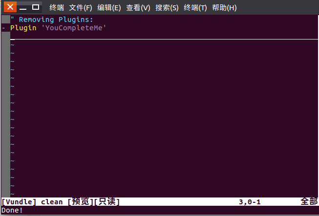

### 什么是 Vundle
vundle 是 vim 中常用的一款插件管理器,许多 vim 插件都会推荐使用它来安装

### 安装vundle 需要的环境
我们可以到 github 中查看 vundle 官网的安装教程
https://github.com/VundleVim/Vundle.vim  

**安装 vundle 需要先安装好 git**  
vundle 进行插件的安装和管理时会去调用 git 到github中进行插件的下载,所以要使用 vundle 必须安装好git

### 使用 pathogen 下载并安装vundle  
vundle 不一定要用 pathogen 安装,可以参考官网的具体操作,但这里还是建议先下载 pathogen 并安装(参考另一篇文章,pathogen安装非常容易), 再用 pathogen 安装 vundle, 因为 pathogen 作为 vim 的另一款插件管理器,不仅安装插件非常方便,许多 vim 插件也推荐用 pathogen 安装,因此一般 vundle 和 pathogen 建议都安装  

```bash
git clone https://github.com/VundleVim/Vundle.vim.git ~/.vim/bundle/Vundle.vim
```

其中~/.vim/bundle/ 我们的安装路径,如果没有这个路径,我们要手动用mkdir 创建.vim 和 bundle 这个目录(pathogen默认到 ~/.vim/bundle/ 寻找插件),这两个目录在 vim 中会很常用到  

#### 编写配置文件 .vimrc
我们编辑 ~/.vimrc (如果没有,则创建它,vim在运行时会自动去读取 ~/.vimrc 里的配置)  
我们可以参考官网给的示例,事实上我们并不需要安装那么多的插件,要运行 vundle,最基本的配置如下  
```bash
"vundle
set nocompatible              " be iMproved, required
filetype off                  " required

" set the runtime path to include Vundle and initialize
set rtp+=~/.vim/bundle/Vundle.vim
call vundle#begin('~/.vim/bundle/vundle/')

" let Vundle manage Vundle, required
Plugin 'VundleVim/Vundle.vim'

call vundle#end()            " required
filetype plugin indent on    " required

```
**需要注意的是**  
vundle#begin('~/.vim/bundle/vundle/') 的括号中的 
'~/.vim/bundle/vundle/'
**是自己设定的路径,之后vundle安装的插件都会被安装到这个目录下,我自己在~/.vim/bundle/下创建了 vundle目录,并指向它**

完成上述配置后,终端输入 vim 回车,输入 :PluginInstall,如果看到页面弹出要安装插件列表,并显示  
prececcing 'VundleVim/Vundle.vim'  
说明正在安装,安装完毕后插件旁会有一个 + 号,如下图

说明 vundle 安装成功,已经可以正常使用了  

### 配置文件如何写
官网的配置文件示例已经写得很清楚, Plugin 后跟的都是要安装的插件,如果我们还不想安装任何插件,则把那些Plugin去掉,但注释上说名"required"的我们必须保留,之后我们要安装插件,就可以像上面例子中写上  
Plugin "路径名" ,**必须写在call vundle#begin() 和call vundle#end() 之间**
#### 安装插件 
然后打开 vim ,输入 :PluginInstall 即可  
#### 卸载插件
打开 ~/.vimrc, 把不需要的 Plugin 注释掉或者删掉,然后打开 vim,输入 :PluginClean ,确认即可,如下图:  
  
#### Plugin 后的路径名
对于Plugin 的路径名,需要分情况讨论,这点在官网给出的示例的注释中也有详细说明
1. "如果插件托管在Github上，写在下方，只写作者名/项目名就行了    
   Plugin 'Valloric/YouCompleteMe'  
2. "如果插件来自vim-scripts(官方)，写插件名就行了  
    Plugin 'L9' 
3. "如果Git仓库不在Github上，需要提供完整的链接  
  Plugin 'git://git.wincent.com/command-t.git'
4. "本地的插件需要提供文件路径  
   Plugin 'file:///home/gmarik/path/to/plugin'  
"一定要确保插件就在提供路径的文件夹中(没有子文件夹，直接在这层目录下) 
5. "运行时目录的路径  
"Plugin 'rstacruz/sparkup', {'rtp': 'vim/'}  
  
6. "避免插件间的命名冲突  
"Plugin 'ascenator/L9', {'name': 'newL9'}  
  
7. "------------------要安装的插件不能写在此行后！------------------  
call vundle#end()            " required  
filetype plugin indent on    " required  
"要忽略插件缩进更改，请改用：  
"filetype plugin on  

以上内容是在官网给出的配置示例的注释中都有讲清楚,我们只需要认真阅读官网的那个例子就能懂

### vundle命令
* :BundleList -列举出列表中(.vimrc中)配置的所有插件
* :BundleInstall -安装列表中全部插件
* :BundleInstall! -更新列表中全部插件
* :BundleSearch foo -查找foo插件
* :BundleSearch! foo -刷新foo插件缓存
* :BundleClean -清除列表中没有的插件
* :BundleClean! -清除列表中没有的插件
注意更新和安装相差了一个!

### 离线使用vundle
有时候我们会有离线安装vim插件的需求,因为我们可能会在开发机上安装自己的vim插件,而公司的开发机是不连网的
这种情况下,我们只能从外部下载,再导入进来,具体做法为:在网络环境允许的条件下从github上下载到这个插件的zip包，然后解压到~/.vim/bundle/这个目录，比如你解压后的目录名为MyPlugin，然后你只需要在~/.vimrc中添加如下：
```bash
Plugin 'MyPlugin'
```
Vundle自动会从~/.vim/bundle目录下找到你这个目录，并且加载其中的插件.

至于在线安装(即使用:PluginInsall安装时),以安装nerdtree为例,我们要在call vundle#begin()和call vundle#end()之间添加:
```bash
:PluginInstall 'scrooloose/nerdtree' 
```
nerdtree插件前面里还有scrooloose，这是为了生成git地址需要，(我们在github搜索时,使用"作者名/仓库名称"将可以唯一锁定一个仓库,而不会有多个选项),如果是离线加载，只需要告诉Vundle你的插件在~/.vim/bundle下的目录名即可。