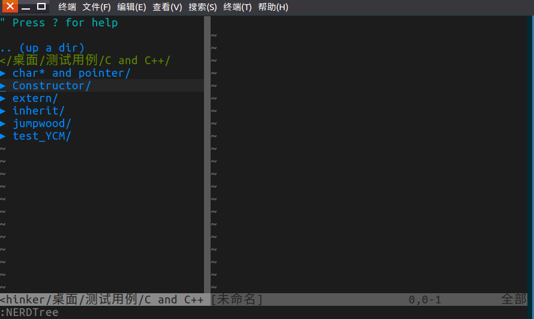

### NERDTree介绍
文件管理插件 NERDTree，几乎是所有拥护 vim 的开发人员都会使用的插件,它能够很方便地帮助我们在一个 vim 界面里面切换目录及文件进行编辑,并且提供了很多有用的键盘快捷键

### NERDTree安装  
我们可以在 github 上搜索 NERDTree,找到这个插件,网址:  
https://github.com/scrooloose/nerdtree  
官网推荐使用 pathogen 进行安装  
```bash
https://github.com/scrooloose/nerdtree.git ~/.vim/bundle/nerdtree
```  
一步命令即可,然后我们可以用 :help NERDTree.txt 查看其文档,同时检验是否安装成功  

### 启动NERDTree  
使用文件管理系统,那么就需要一个根目录,我们只要在终端用 cd 命令进入到根目录路径中,然后输入 vim,回车(注意,此时不需要用vim 打开某个文件了),进入 vim 界面后,输入 :NERDTree  (**注意大小写,可以用 tab 键快速补全,不用输入全部字符**) 回车后,NERDTree就被启动了,我们可以看见目录树会显示在测栏,如下图:  
  


### 建议安装的配套插件
NERDTree 并不完美,还有一些功能不是非常方便,以下两个插件是非常有用的配套插件  
**vim-nerdtree-tabs**  
每次启动vim,都要手动开启 NERDTree,并且当NERDTree 在打开多个tab(标签页)时,新的 tab 页中并没有NEDTree,需要重新开启,并且重新开启的 NERDTree 和其它 tab 下的NERDTree 不共享,即其它 tab 的 NERDTree 光标所在的位置,已经展开哪些目录 和 当前 tab 是没有关系的,这带来非常多的不方便,因此强烈建议安装此插件,没有它的NERDTree并不完美,安装后只需 在 .vimrc 中添加 let g:nerdtree_tabs_open_on_console_startup=1 即可,具体安装见相应的笔记    
**nerdtree-git-plugin**
开发的过程中，我们希望git信息直接在NERDTree中显示出来，和Eclipse一样，修改的文件和增加的文件都给出相应的标注，这时需要安装的插件就是nerdtree-git-plugin  
  

### 在NERDTree界面的常用操作  
#### 窗口切换  
使用 :NERDTree, 会打开目录树窗口,切换文件与 NERDTree 窗口只要使用vim自带的窗口切换功能即可,建议把 NERDTree窗口一直保存在右上方,这也是很多IDE使用的方式  
我们可以让 vim 启动鼠标 
```bash
:set mouse=a   # 也可以在 ~/.vimrc 中全局设置
```
这样我们通过鼠标点击就可以切换窗口,并且通过双击就可以展开目录(收起目录鼠标点不了,按回车),切换标签页也可以用鼠标,关闭标签页可以点击旁边的"x"小按钮

##### 常用切换操作:  
如果NERDTree 目录树窗口在最左边,使用  
Ctrl + w + t 光标跳转到最右边窗口
注意不使用 :NERDTree  虽然它也会跳转到目录树窗口,但每次光标都会跳转到根目录处,这样每个目录要重新展开,很不方便  

Ctrl + w + p 切换到前一个窗口
Ctrl + w + (h 或 l 或 k 或 j) 光标在切换到(上下左右)边的窗口  

##### 利用已经开启的窗口来显示新的文件
当我们已经打开了多个窗口时,有时我们想用其中一个已经开启的窗口(设为x)显示一个新的文件,这时我们可以先将光标放置在原来的窗口x上,然后跳转到 NERDTree 窗口(如果 NERDTree 窗口在右上方,使用 Ctrl + w + t ,因此我建议文件目录树窗口最好就保持在最右上方)  

##### 打开新窗口,标签页  
在 NERDTree 文件目录树界面,我们可以hljk或者上下左右键选择文件,然后按enter键,如果是目录则会展开目录,如果是文件显示文件(若已经有显示文件的窗口,则不会添加新的窗口,而是使用上一次光标最后所在的那个窗口),按下enter键显示文件后光标会进入新打开的文件中,与此类似的操作有
o 在已有窗口中打开文件、目录或书签，并跳到该窗口
go 在已有窗口 中打开文件、目录或书签，但不跳到该窗口
t 在新 Tab 中打开选中文件/书签，并跳到新 Tab
T 在新 Tab 中打开选中文件/书签，但不跳到新 Tab


#### 在NERDTree界面创建文件  
当光标在NERDTree窗口时,点击 "m",会出现许多选项,包括
(a)dd a chidlnode 添加以一个节点  
(m)ove a chidlnode 删除一个节点    
等等...   
我们使用 ma 就可以创建一个节点,并请你输入节点名字,回车即可,它也会提示你,如果你要创建的是一个文件夹,那么请在文件夹名称背后加一个"/",这样NERDTree 就知道你要创建的是目录而非普通的文件.

#### 刷新NERDTree 
点击 r, 会刷新NERTree ,有时我们执行了一些操作使NERTree 中的文件列表有更新,而 NERTree没有及时显示,那么我们就可以使用此命令
