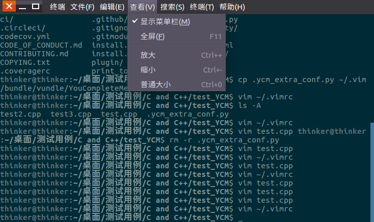

vim 的字体大小是继承终端字体大小设置的,我们要调节 vim 字体大小,只需要调节终端字体大小

对于不同的终端,需要不同的操作
###  Gnome Termianl   
这也是 Ubuntu 的终端, 调节字体大小非常容易,在菜单栏里点击查看,点击放大,就可以放大字体,点击缩小,就可以缩小字体  
效果图如下:  
 
当然也可以用快捷键(菜单栏上有说明) 
Ctrl + '+' 放大字体  
Ctrl + '-' 缩小字体  
要注意的是, **'+' 和 '-'应该用 BACKSPACE 键旁边的按键,此时使用'+'还要按下 SHIFT键 ,数字栏旁边的'+','-'有时不起作用**
