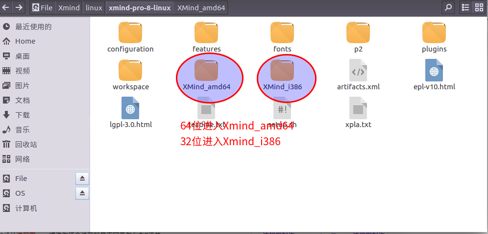
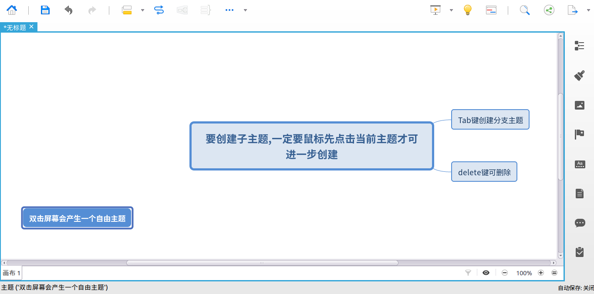
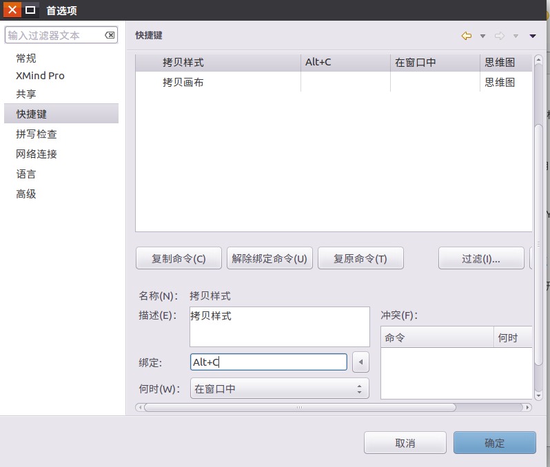

### Xmind介绍
XMind 是一款思维导图软件,它有免费版和商用版,其中免费版就提供了非常多的功能,足以满足一般画思维导图的需求  
### 安装
Xmind 有中文版本,我们直接搜索 "Linux Xmind 中文版 ",进入官网下载压缩包然后解压即可  
解压后进入加压后的文件夹,如下图:  
  
64位的计算机进入 XMind\_amd64 文件夹, 32位的计算机则进入XMind\_i386文件夹  
里面有一个可执行文件,XMind,双击即可运行启动  
付费版和免费版有区别,如果我们没有购买获得license,那么有一些功能它会提示我们无法使用,而能使用的,毫无疑问就是免费版提供给我们的了,免费版已经提供了非常多的功能  
  
### 基本使用方法    
快捷键 Tab 或 Enter 插入一个子主题,**注意要创建一个子主题,一定要先用鼠标点击上一个主题,才能够进行插入**  
  

在主题框中输入文字时,直接按回车相当于确定内容,而不能起到换行效果,要使用换行按 SHIFT + ENTER
    
上面一排和右边一排许多功能自己尝试,**有一些功能,比如格式,是要先用鼠标点击指定某一个方框后才能进一步生效的**  
我们点击某个主题或子主题,然后右键可以找到插入选项,同时可以看见这些插入的选项中旁边有快捷键提示,我们可以通过这个来了解一下常用工具的快捷键并记住它们  

导出图片,导出pdf等功能在右上角小箭头那里  

### 绑定快捷键  
为一些常用功能绑定快捷键是很有必要的,这样可以提高我们的效率  
比如拷贝样式和粘帖样式,有时候我们会自己设计一个单元框,比如字体大小和样式.我们希望这个样式运用到其它单元框上,默认拷贝样式和粘帖样式这两个功能是没有快捷键的.因此我们需要去设置
 
在Xmind左上角菜单处找到"编辑",选择"首选项",可以找到快捷键设置  
