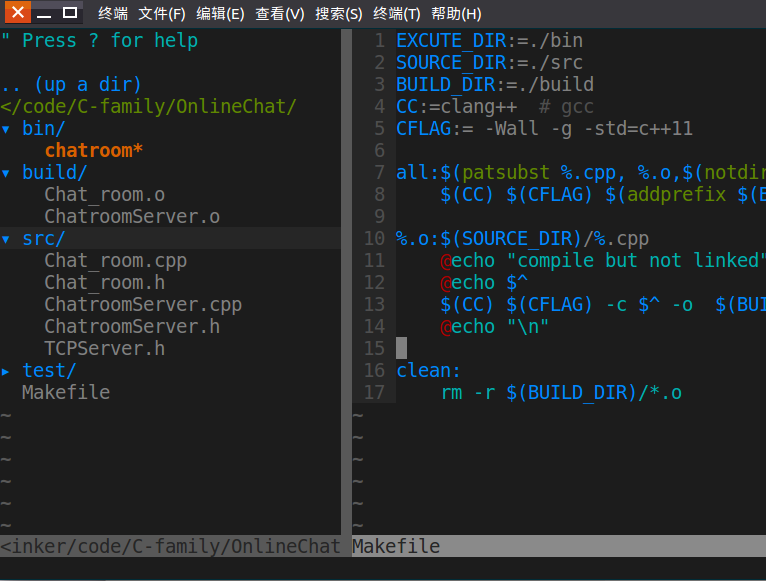

### 通配符 % 和 *
我们要明确 % 和 * 的区别:
makefile 三要素:目标,依赖文件,执行的命令
```bash
目标:依赖文件  
	执行的命令
```

其中 % 号在 "目标","依赖文件"中有效,而在"执行的命令"中无效  
即
```bash
%.o:%.cpp:  #正确
	gcc %.o -o output  #错误,命令中不会识别 %.o
```

其次 % 必须有上下文环境,比如有个依赖文件是 main.o,在查找过程中,遇到 %.o时,%才会被替换,如果直接使用%.o,make命令是不会去替换%号的,因此 % 和 \* 的意义显然是不同的    
再如使用 %.o:%.c 表示所有.o文件会去寻找相对应(**注意是相对应**)的.c文件,比如 a.c 则会去查找 a.o, fun.c 则会去查找 fun.o 

\* 则在 "执行的命令" 中起作用,即表示任意个字符,这和在终端语法是一致的    
```bash
gcc *.cpp -o out  # *.cpp表示当前所有以.cpp为后缀的文件 
```  
但在makefile 的"目标","依赖文件"中并不能直接起这个作用,如果要让\*起到这个效果,必须使用makefile的 \$(wildcard) 函数,间下面讲解
### 常用的简写(自动化变量):
```bash
$@ 表示目标,在命令中是一个一个取出来的
$< 表示第一个依赖,如果目标是以%定义的,那么此时$<将是一个文件集,每次都会与%相对应地一个个取出来  
$^ 所有依赖文件,这是一个集合,如果有重复的会去除
```  
自动化变量
\$^ 表示所有依赖,但当依赖有多个时,每个依赖会单独替代这个\$^并执行一次命令  
例子
```bash
all:a.cpp b.cpp c.cpp
	@echo $^  
    # 会执行三次echo,即分别执行@echo a.cpp,@echo b.cpp,@c.cpp
```
### 常用函数介绍  
makefile 提供了一些便于描述文件的函数,使用格式如下  
```bash
$(函数名称 参数1,参数2,...)
```  
这些函数要熟练掌握其应用建议看最后给的[例子](#demo).
#### 通配符函数 wildcard  
前面已经介绍,在目标和依赖文件里\*是不起作用的,因此,就要用到 wildcard函数了,wildcard,中文意为通配符,即它使\*生效,表示任意多个任意字符  
比如src目录下有多个cpp文件,那么 
```bash
$(wildcard  ./bin/*.cpp)  #  *表示任意数量个任意字符
```  
这里$(wildcard  ./bin/*.cpp)取到./bin/目录下所有以cpp为后缀的文件集合

#### 字符替换函数 patsubst 
这个函数接收三个参数,举例更容易说明
```bash
$(patsubst %.c,%.o, A.c B.c C.c )
# 第一个参数%.c会到第三个参数中寻找%的替代字符,即%最后会匹配到A,B,C
# 接着把%找到的替换代入到第二个参数中输出结果,即最后结果为 A.o B.o C.o
```  

#### 去除路径函数 notdir  
去除文件变量前面带的路径,有时候我们需要用通配符 wildcard 去匹配文件,为了匹配到文件我们需要指定文件路径,这样得到的结果自然是带路径的,用此函数可以去除路径  
```bash
$(notdir /home/code/a.cpp)  # 得到 a.cpp 
```
#### 添加前缀函数 addprefix  
```bash
# $(addprefix 前缀,变量)
 $(addprefix /home/code/, a.cpp) # 得到/home/code/a.cpp
```

### 静态模式
静态模式可以用于在集合中一个个取出目标,比如我们要把一个目录下每个.c文件都分别编译成与其对应的.o文件,就可以用这种语法
```bash
<targets ...>: <target-pattern>: <prereq-patterns ...>
　　<commands>
```
举例:将当前Makfile目录下所有.cpp文件都分别编译成对应的可执行文件
```bash
CC=g++
SRCS     = $(wildcard *.cpp)  # 取到当前目录下所有cpp文件
OBJS     = $(patsubst %.cpp, %.o, $(SRCS)) # 转换为相应的.o
TARGETS  = $(SRCS:%.cpp=%) #相当于去除了后缀,比如a.cpp b.cpp ,则TARGETS为 a b

all : $(TARGETS)
# 这种转换与上面不同,hello 将依赖与hello.cpp
$(TARGETS): %: %.cpp
	$(CC)  -o $@ $<
```
假设目录下有 a.cpp b.cpp c.cpp 
则会分别执行
g++ -o a a.cpp
g++ -o b b.cpp
g++ -o c c.cpp
最终在此目录下生成a b c 三个可执行文件

### 不要回显命令  
多数时候用在 echo 上,因为 makefile 被执行时将会输出这条命令本身,以及这条命令执行后的输出,比如
echo "hello",则执行时会显示
```bash
echo "hello"
hello 
```  

如果使用 @echo hello,则显示
```bash
hello
```
### 指令出错不通知,继续执行
在命令前加一个 - (减号),表示如果这个命令执行失败,不要报错,并继续执行后续的构建命令  
```
# ......
%.o :%.cpp
	-mkdir bin #假设已经存在bin目录,则该命令会出错,但不报错,继续执行其它后续工作
```
### <span id="demo">例子</span>  
项目的目录结构如下图:  
  
根目录 OnlineChat下有四个目录 bin build  src 以test,一个Makefile文件, src 存放源码, build 存放编译但未链接的.o文件,bin生成最终由.o文件链接生成的可执行文件,要让这个项目的编译自动化进行,就可以用如下maleficent文件  
 
```bash
EXCUTE_DIR:=./bin
SOURCE_DIR:=./src
BUILD_DIR:=./build
CC:=clang++  # gcc
CFLAG:= -Wall -g -std=c++11

# all 的依赖文件为所有 与cpp文件同名的.o文件(不带路径)
all:$(patsubst %.cpp, %.o,$(notdir $(wildcard $(SOURCE_DIR)/*.cpp)))
	$(CC) $(CFLAG) $(addprefix $(BUILD_DIR)/,$^) -o $(EXCUTE_DIR)/chatroom

# 找到与.o文件相对应的cpp文件,注意要补上路径才能找到
%.o:$(SOURCE_DIR)/%.cpp
	@echo "compile but not linked"
	$(CC) $(CFLAG) -c $^ -o  $(BUILD_DIR)/$(notdir $@)

clean:
	rm -r $(BUILD_DIR)/*.o  
```
