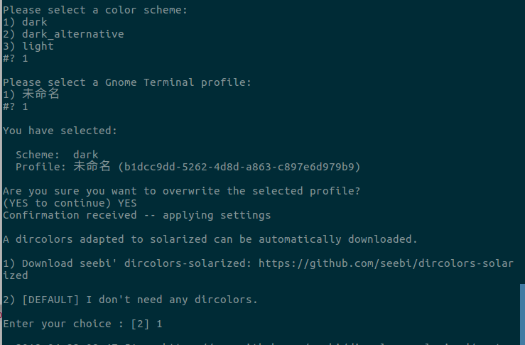

# 给Ubuntu 操作系统终端背景调色
### gnome-terminal-colors-solarized 官网  
https://github.com/Anthony25/gnome-terminal-colors-solarized  
上面的安装讲得很详细

#### 确保安装 dconf
sudo apt-get install dconf-cli


安装很简单,git clone 下来然后按以下执行即可
```bash
$ git clone https://github.com/Anthony25/gnome-terminal-colors-solarized.git
$ cd gnome-terminal-colors-solarized
$ ./install.sh
```

我们要选择dark主题,可以直接使用  
./set_dark.sh  
也可以使用  
./install.sh -p  
选择dark,只不过多了一步,输入选择时输入数字,对于 select profile name,输入一个数字1即可  
Are you sure you want to overwrite the selected profile?  输入 YES  
A dircolors adapted to solarized can be automatically downloaded.  输入1,把它下载下来(不下输入2也可以)  


安装过程以及效果图如下:  

**但还有个问题,主题是变了,但是使用ls 时全都是白的很难辨认各种文件,因此还要下载插件**
### 使用dircolors-solarized 进行补充  
```bash
git clone https://github.com/seebi/dircolors-solarized.git  
cd dircolors-solarized/
```
里面有 有256dark,ansi-dark,ansi-light等多个配色，这里用256dark 
```bash
cp ~/dircolors-solarized/dircolors.256dark ~/.dir_colors/  
eval dircolors ~/.dir_colors  
```  
有的 ubuntu 操作系统文件名叫 ~/.dircolors/,如果没找到 dir_colors 则ls 看一下  
eval dircolors 后面的 dircolors 是一个命令,它是用于设置 ls 指令在显示目录或文件时所用的色彩  
### gnome-terminal-colors-solarized 安装过程  
```bash
This script will ask you which color scheme you want, and which Gnome Terminal profile to overwrite.

Please note that there is no uninstall option yet. If you do not wish to overwrite any of your profiles, you should create a new profile before you run this script. However, you can reset your colors to the Gnome default, by running:

    Gnome >= 3.8 dconf reset -f /org/gnome/terminal/legacy/profiles:/
    Gnome < 3.8 gconftool-2 --recursive-unset /apps/gnome-terminal

By default, it runs in the interactive mode, but it also can be run non-interactively, just feed it with the necessary options, see 'install.sh --help' for details.

Please select a color scheme:
1) dark
2) dark_alternative
3) light
#? 1

Please select a Gnome Terminal profile:
1) 未命名
#? 1

You have selected:

  Scheme:  dark
  Profile: 未命名 (b1dcc9dd-5262-4d8d-a863-c897e6d979b9)

Are you sure you want to overwrite the selected profile?
(YES to continue) YES
Confirmation received -- applying settings

A dircolors adapted to solarized can be automatically downloaded.

1) Download seebi' dircolors-solarized: https://github.com/seebi/dircolors-solarized

2) [DEFAULT] I don't need any dircolors.

Enter your choice : [2] 1

--2018-04-23 08:47:51--  https://raw.github.com/seebi/dircolors-solarized/master//dircolors.ansi-dark
正在解析主机 raw.github.com (raw.github.com)... 151.101.76.133
正在连接 raw.github.com (raw.github.com)|151.101.76.133|:443... 已连接。
已发出 HTTP 请求，正在等待回应... 301 Moved Permanently
位置：https://raw.githubusercontent.com/seebi/dircolors-solarized/master//dircolors.ansi-dark [跟随至新的 URL]
--2018-04-23 08:47:51--  https://raw.githubusercontent.com/seebi/dircolors-solarized/master//dircolors.ansi-dark
正在解析主机 raw.githubusercontent.com (raw.githubusercontent.com)... 151.101.76.133
正在连接 raw.githubusercontent.com (raw.githubusercontent.com)|151.101.76.133|:443... 已连接。
已发出 HTTP 请求，正在等待回应... 200 OK
长度： 10278 (10K) [text/plain]
正在保存至: “/home/thinker/Linux_application/终端配色/gnome-terminal-colors-solarized/dircolors”

/home/thinker/Linux 100%[===================>]  10.04K  --.-KB/s    in 0s      

2018-04-23 08:47:52 (35.0 MB/s) - 已保存 “/home/thinker/Linux_application/终端配色/gnome-terminal-colors-solarized/dircolors” [10278/10278])


The new dircolors have been installed as /home/thinker/.dir_colors/dircolors.

Add "eval `dircolors /path/to/dircolorsdb`" in your shell configuration file (.bashrc, .zshrc, etc...) to use new dircolors.
For Fish, add the following to config.fish instead:
	eval (dircolors /path/to/dircolorsdb | head -n 1 | sed 's/^LS_COLORS=/set -x LS_COLORS /;s/;$//')

Do not forget to remove old dircolors from your shell configuration file if they were named differently than the one newly installed.

```
