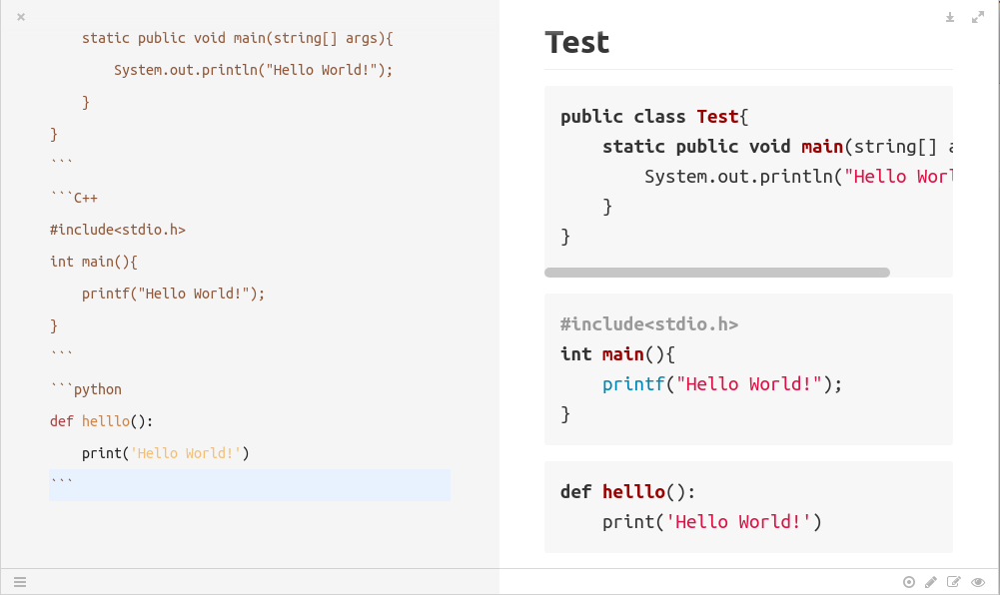

# MarkDown语法
[TOC]
### 支持所有HTML标签
markdown支持所有html标签的渲染,如果你不知道粗体是\*\*粗体文字\*\*,那么用&lt;b&gt;粗体文字也是可以的&lt;/b&gt;
### 转义
在markdown中,\*,\-等符号是其语法符号,如果我们直接打出 \*\*符号间文字\*\*,在markdown中就会被翻译为粗体:**符号间文字**  
有时我们只是想让这些符号作为内容,那么就需要使用转义,用但斜线 '\'+符号就表示转义,比如\\\*,在markdown中就会被翻译为*

当然像"&amp;","&lt;","&gt;"等是没办法用\\转义的,别忘了Markdown是支持所有html标签渲染的,所以这些符号可以用HTML代码实现,下面举例常用的符号代码:  
 &amp;lt; 小于号"&lt;"  
 &amp;gt; 大于号"&gt;"  
 &amp;amp;  符号&  
 &amp;nbsp; 空格
### 换行
换行有两种方法:  
1. 按两次回车,如果只按一次回车,那么在编辑器中一段文字下一行的内容被渲染后仍与该段文字在同一行
2. 空格+空格+回车,这是比较常用的方式,因为在编辑器看也会更方便  
3. 上面两种换行方法只能换一行,不管你敲打多少次回车,始终都只是换了一行  
   如果你想两段文字间隔多行你需要用的就是&lt;br&gt;标签

但需要注意的是,有时候按两下回车是有必要的,特别是不想让后面的内容被前面的格式影响时.  
比如在编辑器中,"2\.空格+空格+回车,这是......"这段内容和这段话之间必须隔一行,也就是按两次回车,否则就会出现下面的效果:  
2. 空格+空格+回车,这是比较常用的方式,因为在编辑器看也会更方便  
但需要注意的是,有时候按两下回车是有必要的,特别是不想让后面的内容被前面的......

### 缩进
markdown 本身不支持缩进,如果在段首输入空格是不会起作用的(但在文字内容间输入空格有效,另外在代码块中段首空格也有效)

如果真的需要空格缩进,有以下方法:
1. 用转义符号 &amp;nbsp; 注意分号 ;  别漏了
2. 在输入法中设置输入为圆角字符,这样段首的空格一样不会被markdown过滤掉  

##### 列举缩进
有时我们需要列举,并希望列举的对象相对文本有缩进,可以用如下方法:
1. 数字法,输入"1. 文字....","2. 文字.....",则markdown会进行缩进,注意"."后面要加个空格
2. 黑点缩进,"\* 文字内容..." ,"\*"后面有个空格这样文字也会有缩进,并在列举的每一点前会有一个小黑点,举例
**注意列举结束后,后面的文字与列举的文字中间要空一行(有时是两行,总之多按几下回车就会解除缩进),否则后面的文字全部会被缩进**  

```markdown
1. 这是第一点
2. 这是第二点  ,注意这里列举结束后要空两行(多数情况下是一行即可)


* first point,f前面有一个空格
* second point
```
效果如下:
1. 这是第一点
2. 这是第二点  ,注意列举结束后要空一行


* first point,f前面有一个空格
* second point

### 标题
markdown的标题总共有六级,一个\#表示一级,比如:
```markdown
### 三级标题

## 二级标题

# 一级标题 
```
注意"#"后面与标题内容间有一个空格

******************************************************

### 目录
在markdwon文件中输入`[TOC]`会被渲染展示出目录,目录的层次和顺序依据是根据标题及标题的等级
目录是一个非常有用的功能, 渲染成 HTML 后是一个 a 标签,点击后就可以快速跳转


### 代码块
三个 \`\`\`(注意是点Tab键上面那个)+语言+ \`\`\` 可以形成一个代码块,比如
如果你在\`\`\`后面不加上语言,则为一个普通的块,无法做到语法高亮  
例子:  
\`\`\`C++ 

#include<stdio.h>
int main(){

&nbsp; &nbsp; &nbsp; &nbsp; printf("Hello World!");

}

\`\`\`

结果:
```C++
#include<stdio.h>
int main(){
    printf("Hello World!");
}

```
### 文字渲染
 
使用三个`的代码是带有语法高亮功能的,而且在代码块中 markdown 的特殊字符不会被转义,但有时代码块很短,比如我们只是想用代码块突出显示一个函数名称,
这时我们可以用两个\`(!左边的按键) 构成的\`\`代码块,**这种代码块非常常用,它书写简单,而且还能解决一些转义问题**如
\`Function\` 在markdown 中会被渲染为 `Function` 

\*\*粗体\*\* **粗体**  
\*斜体\* *斜体*  
\~\~删除线\~\~  ~~删除线~~  
&lt;一级引用 &lt;&lt;二级引用 &lt;&lt;&lt;三级引用
>这是一级引用,记得下面还要空一行才能写内容,否则会在同一行
>>二级引用  
>>>三级引用  

### 图片
格式 \!\[Alt text\]\(img.jpg "Optional title"\)  
\!\[相当于 img 的alt\]\(这里是相对路径,以当前md文件为基准"Optional title表示会在鼠标放在图片上后显示的文字"\)  
括号里的不仅可以是图片与当前 md 文件的相对路径,也可以是一个网络图片的网址.  
这很好理解,括号里的路径就对应于html里 img 标签的 src 属性,除了可以指向当前目录外,还可以指向其它网站上的图片并显示  
通过这以特性,我们可以把图片放在自己的github上,然后指向它,这样我们的 md 文件在其它位置打开渲染后仍然可以显示图片  
举例:  
\!\[test\]\(img/测试.png "鼠标放在图片上后会显示的文字"\)  


#### 自定义图片的格式
使用\!\[\]\(\)只是把原图嵌入进来,我们不可以改变它的大小,更不能设置图片居中等效果,要能够自定义图片的效果,我们可以使用原生的HTML
```html
</img>

<!--假设与当前markdown文件在同一路径下还有一个名为img的目录,img目录下存放了一张名为hello.png的图片,可以采用这种方式导入-->

<p style="text-align:center;margin:50px"></img></p>
<!--借助HTML我们还可以设置其样式,比如使图片居中,设置外边距等-->

```

### 链接
markdown会对我们的网址链接进行渲染,比如 https:\/\/www\.baidu\.com 会直接渲染成 https://www.baidu.com

##### 段内链接
比如:
\[你好\]\(\#jump\)渲染后的结果为:[你好](#jump) 点击后会跳转到当前页面下 id 为 jump 的span标签中  

下面是 &lt;span id = "jump"&gt;你好&lt;/span&gt;   渲染后的结果:  
<span id = "jump">你好</span>  
注意span标签里面也可以用\!\[\]\(\)图片哦,就相当于html的span标签里套了个img标签
### 数学符号
写在两个\$符号之间的所有数学符号会被markdown渲染,Markdown 的符号名字很很有规律'\\' + 英文名字或缩写  

比如:\$\\sum\$ 被渲染后为 $\sum$  
分式:{分子}\\over{分母} 或 \$\frac{分子}{分母}\$,比如 \$1\over{2x+1}\$, \$frac{1}{2x+1}\$ 渲染后均为${1}\over{2x+1}$  
建议用\\frac表示分式

注意我们这样把一整个数学公式放在一对\$符号间即可: 如 \$\sum_1^n\frac{1}{3x+1}\$ 渲染后为 $\sum_1^n\frac{1}{3x+1}$  

### 表格  
markdown 用来描述复杂的表格并不轻松,这里介绍如何建立简单的表格:

| Name | major | id |
| :- | :-: | -: |
| Harry Potter  | Computer science| 201802222309 | 
 
markdown如下
```markdown
注意! 前面的文字必须与表格空一行,否则表格不显示

| Name | major | id |
| :- | :-: | -: |
| Harry Potter  | Computer science| 201802222309 | 
```
第一行,每一列置于两个 \| 之间
第二行指定不同列单元格内容的对齐方式,,以\| \- \| 的形式,有多少列就有多少个 \| \- \| ,**如果不需要对每一列的格式都定义,那么第二行用一个\|\-\|即可**
1. \| \- \| 形式为默认形式:居中对齐
2.  在 “-” 右边加上 “:” ,即 \| :\- \| ,为右对齐
3.  在 “-” 右侧加上 “:” 为右对齐
4.  在两侧都加":"为居中对齐  

markdown 原生态语法定义表格不能满足复杂的需求,需要定义复杂的表格可以用 HTML + CSS
