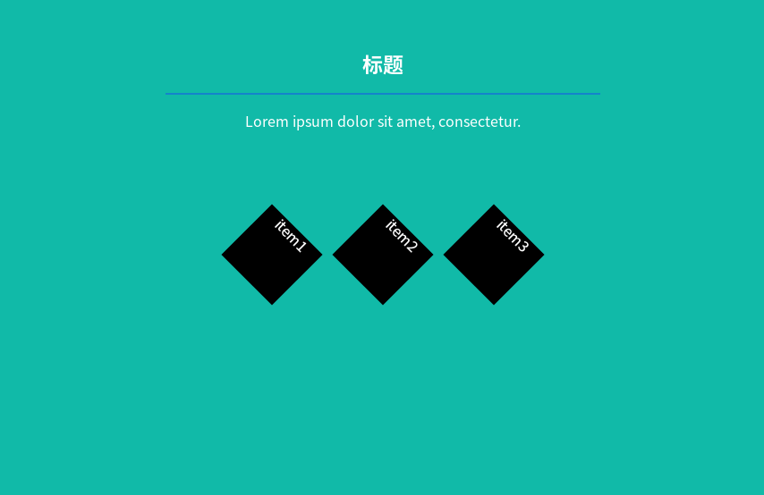
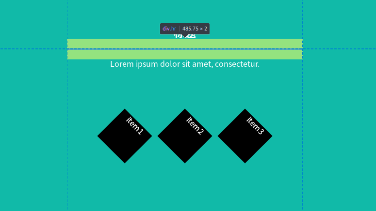
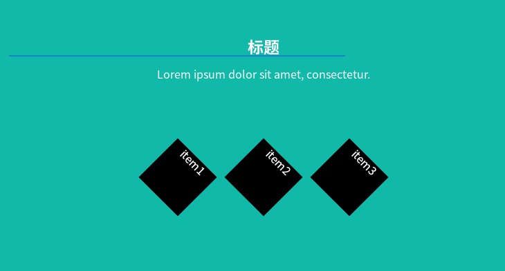
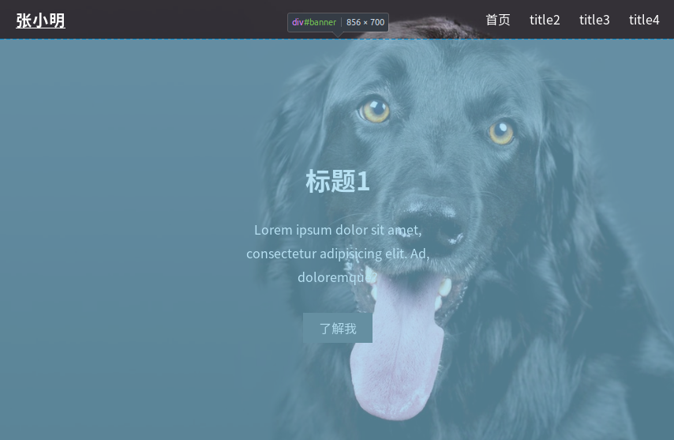
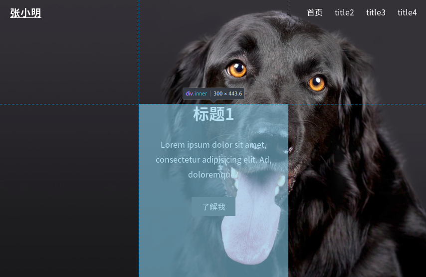
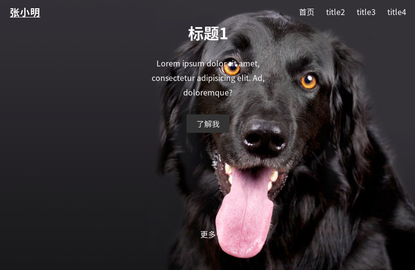
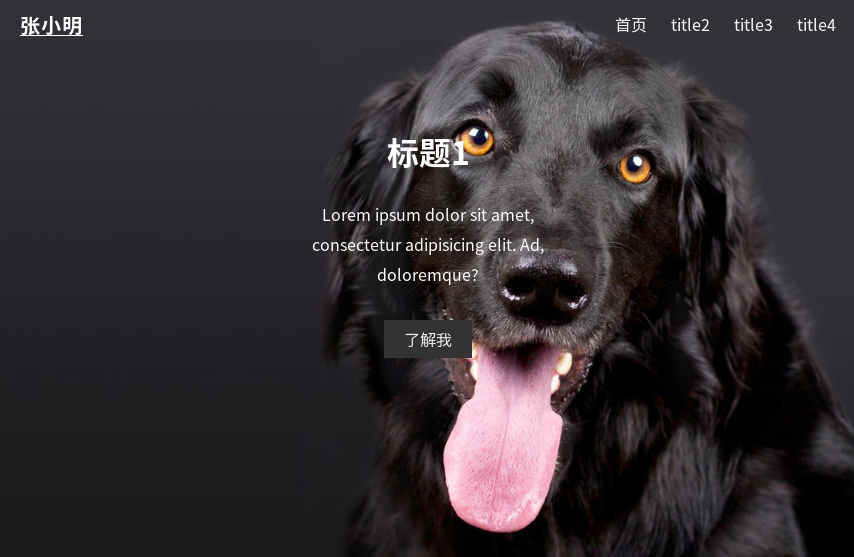

##  模块布局思想
div+CSS布局是当代非常流行的布局方法,这种手段的布局思想是模块化的思想:  
先把整个页面划分为几个模块,而每个模块内部又可以继续划分成更小的模块,一个最小的模块由相互关联的元素(文字图片)构成.  
每个模块都由一个&lt;div&gt;&lt;/div&gt;标签表示,我们在div标签内放置元素(元素,图片),或者放置div标签进行进一步的模块划分.  
于是我们可以控制模块的绝对位置,不同模块间的相对位置,以及内部元素在此模块中的相对位置来控制布局  
### 盒模型
盒模型是CSS描述一个模块的各种位置属性的模型,包括外边距(margin),内边距(padding),元素的高度(height)和宽度(width)  
  
我们使用盒模型来描述模块的位置属性,**一个模块逻辑上就对应上一个盒模型,这里的模块指的是所有HTML元素,即所有HTML元素都可以看作盒子**  
元素就是我们的文字和图片,当我们控制两个不同模块的位置时,我们可以调节margin,我们要调节一个模块内部元素在此模块的相对位置时,我们可以调节padding,或者更精确地控制padding-left,padding-top等等属性  
<br>
具体盒模型中各属性的定义与用法请参考我的其它文章  
 
## div不应占据任何空间
浏览器中div标签的 margin 默认是不为0的  
在编写HTML时,一对 &lt;div&gt;&lt;/div&gt; 标签表示一个模块,模块与模块的关系就是 div 标签的关系,为了便于控制模块之间的位置,我们最好不要让div标签占据任何空间,进行CSS reset 或引入normalize.css后,div的margin将为0  
如此一来,div就纯粹成了逻辑上的块(division),
我们的目标是**精确地控制 div 标签 与 div 标签的位置关系**,这样整个页面的布局就能在我们把控之中  
## 明确地定义我们想要的结果
我们希望最后开发时见到的页面就是最终在不同的浏览器里看见的页面.  
如果我们不希望浏览器的默认设置(比如对一些标签的margin padding等的默认设置)给我们带来不可控的因素,我们就需要**亲自去定义相应的CSS,以覆盖浏览器的默认行为**  
比如我们希望某个div标签在不同浏览器上的margin都必须是20px,那我们就需要为其写相应的CSS,有了明确的定义,浏览器就不会采用默认的行为了  

## 位置布局的技巧
####  1.用背景色填充模块,以观察页面布局 
  
在嵌入图片前,先用背景色填充每个模块,能够很方便的显示每个模块的大小以及位置.  
比如黑色部分我将要放入标签,如果只有文字"item1"又全部被背景色蓝色覆盖,那观察起来就比较困难了  
另外,有时候一些标签,比如h1,p等会自带外边距(margin),没有控制好 margin 可能导致模块与模块之间出现空隙,如果每个模块都被填充满颜色,那么我们将很容易看见这些空隙.  

####  2.一切皆模块
###### 使用div
我们需要不断地作出抽象,将页面划分成模块,然后用div标签配上不同的  class 或 id 去描述每一个模块,最终我们多数时候只要操纵响应的div即可  
###### display属性
CSS中有两种元素:  
一种是**内联元素(inline)**,前后不会换行，一系列内联元素在一行显示，直到排满，加上 width 和 height 没效果  
一种是**区块元素(block)**,独立一块，会换行,可以加上对应的width和height，通常使用在网页的布局，最常用的就是&lt;div&gt;标签
display:block;的意思把内联元素转换为区块元素
而对应的是display:inline;的意思是把区块元素转换成内联元素  
**常见的块级元素**：div,p,table,h1~h6,ul,li,ol  
**常见的内联元素**：span ,img ,input ,lable,select,a  
<br>
**inline-block**:
我们有个时候既希望元素具有宽度高度特性，又具有同行特性，这个时候我们可以使用inline-block  ,比如自制导航条
#### 3.控制位置的常用控制手段
##### 3.1居中
1. 文字在模块中居中,使用 ```text-align:center;```  
2. 制作导航条时,设置行高(line-height)与导航栏背景高度相等,可以使得导航栏的文字垂直方向上居中(这种方法适合于模块内只有一行文字的情况)
3. 模块要水平居中,可以使用```margin:?px auto```,?px表示magin-top 和 margin-bottom,auto 则为margin-left 和margin-right 的值,当设置为 auto 时,模块将居中: 如下图虚线模块为一个水平分割线:  


```CSS
.hr {
	height: 2px;
	background: #1484cb;
	margin: 20px auto; /*注意此处*/
	width: 66%;
} ```


如果我们去掉```margin:20px,auto;```,那么效果则如下图  
  
显然,水平线将不再居中  

要控制一个模块与另一个模块的相对位置,我们可以用(外边距)margin,
如果一个模块(称作子模块)在另一个模块的内部(父模块),我们要控制子模块在父模块的相对位置,可以使用以下方法:
1. 控制 padding 父模块的值,因为子模块在父模块的内部,相当于父模块的内容
2.  设置```position:relative;```,然后再控制top left right bottom  
###### 举例
观察下图界面,我们用一个id为banner的div表示一个父模块,如下图
  
再用一个class为 inner的div作为一个子模块,这个模块包括一个标题,一段文字,以及一个按钮,如下图:  
  
它是如何到达那个位置的呢观察它的CSS
```CSS
#banner .inner {
	max-width: 300px;
	text-align: center;
	margin: 0 auto;  /*这里的 auto 使得在div#inner父模块内水平居中*/
	position: relative; /* 采用相对位置,相对的是整个父模块,即div#inner*/
	top: 160px;  /*离父模块的最顶部160px*/
	color: #fff;
}```
下面看看将 position:relative; top:160px去掉看结果如何
  
子模块来到了最顶端,除了采用top,我们也可以使用padding,因为div.inner是div#banner的子模块,也是它的内容,要改变div#inner的位置,我们要操作div#inner的padding,当然我们可以更具体地操作padding-top,padding-left,padding-bottom,padding-right
```CSS
#banner {
	background: transparent;
	height: 700px;
	padding: 84px; /*这样子模块的位置也会改变*/
}
```
效果如下:  

#### 3.3 使用float控制位置
如上一张图的导航部分("首页 title2 title3 title4"),使用 float:right 可以快速使模块位于右边.要注意的是float可能会带来一些坑,具体可以查看float的相关用法及清除浮动等知识
#### 3.4 像素还是百分比  
当需要对模块
使用像素 px 控制会带来的问题是
## 需要注意的一些坑  
#### font-size带来的一些空隙
 一般空隙的产生是因为 margin 所导致,但有时候font-size也是会影响div的边距,特别是使用了display:inline-block的时候也要注意这个问题,具体原因不再展开.  
 如果一个div因为 font-size 产生了边距,我们可以对这个div标签定义 ```font-size:0px;```  
 ###### 举例
 ```HTML
 <!--定义了两个div,我们的目标是让它在同一个水平上,分别占据40%和60%-->
 <div class="test"> 
      <div class="part1" >dsahkjda</div>
      <div class="part2">Lorem ipsum dolor.</div>
</div>
 ```
 ```CSS
 .part1 
 {
	height: 20px;
	background: #870a0a;
	display: inline-block;
	width: 40%;
	margin: 0px;
}
.part2 {
	height: 20px;
	background: #422dae;
	display: inline-block;
	width: 60%;
	margin: 0px;
}
```
效果如图:  
  
margin设为了0,display:inline-block; 宽度width加起来也刚好为100%,却没有在同一水平上,原因就是font-size为 0 所导致
我们只要将包含这两个div的父div(class="test")的font-size设为0px;即可  
```CSS
.test {
	font-size: 0px;
}
```
结果如下:  
  
 因为对div定义了```font-size:0px;```导致文字无法显示,则我们可以对 div 内部的文字部分另外定义 font-size 以覆盖继承来的```font-size:0px```
#### 浮动的使用与清除浮动
 使用float可以很好地控制块的移动,但是有时会带来一些坑,具体可以去参考清除浮动的知识,可以简单地理解为:如果一个模块使用了 float ,那么这个模块好像是"浮"了起来,其它本来挨着的模块逻辑上将不再挨着,可能会跑到它下面被它覆盖了,一个解决的有用办法是将其设为inline-block  
 #### 标签自带margin
 诸如 &lt;p&gt; 标签, &lt;h1&gt; 标签等,浏览器为其设置默认的 margin 值,即使包含了这些标签的父模块div中设置了 margin 为0px,一样不能排除这些标签本身的margin带来的影响(因为margin,padding等属性是不会继承的)  
 因此如果发现模块之间有了一些空隙,修改 margin 是常用的手段
 
