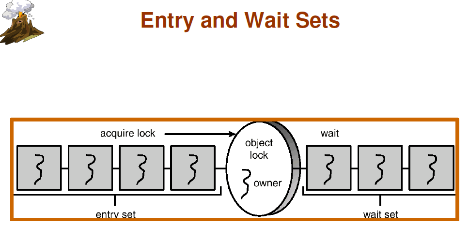

参考文章:
http://blog.csdn.net/zhangzhaokun/article/details/6395557

每个 Java 对象都会有**一个** Monitor锁,这个锁是实现同步的关键所在,对于被sychronized修饰的对象,在**某一个时刻只能有一个线程**拥有Monitor锁  

Java会为每个对象维护两个数据结构 Entry Set 和 Wait Set,  示意图如下：
  

### Entry Set
Entry Set 中放置的是等待获取这个 Monitor 锁的线程,一旦正在占用 Monitor 锁的 Thread 将锁释放,Entry Set 中的线程就会去争抢它.    
但是只能有**任意的一个** Thread 能取得该锁，而其他线程依然在entry set中等待下次来抢占到锁之后再执行。
### Wait Set　
WaitSet 存储的是**曾经获得过锁**,但是调用了 **wait()** 将锁释放的线程.   

在wait set区域的线程获得Notify/notifyAll通知的时候，随机的一个Thread（Notify）或者是全部的Thread（NotifyALL）会从 Wait Set 进入 Entry Set中,和原来 Entry set 中去抢占锁.  

### notify notifyAll区别
notify 一个线程,notifyAll唤醒所有线程,虽然最终只有一个线程获得锁,但只有在 Entry set 中的线程才会去抢占锁(当第一次调用 start 方法时线程对象是在 Entry set 中的).如果一个线程抢占到锁后没有调用 notify 就进行了 wait,若 Entry Set中没有对象,则会死锁

### 注意事项
使用锁会降低效率,甚至造成死锁,因此要谨慎使用


示例代码
```java
package cn.chao.grammer;
class NumberPrint implements Runnable{
    private static int lock = 4;
    private int number;
    public byte res[];
    public static int count = 10;
    public NumberPrint(int number, byte a[]){
        this.number = number;
        res = a;
    }
    public void run(){
        synchronized (res){
            while(count-- > 0){
                try {
                    lock--;//第一次进来是lock 为 3,第4次进来时触发 notifyall,此时有3个先横会被唤醒
                    if(lock==0) {
                        res.notifyAll();//唤醒等待res资源的线程，把锁交给线程（该同步锁执行完毕自动释放锁）
                    }
                        System.out.println(" "+number);
                    System.out.println("ready to wait");
                    res.wait();//释放CPU控制权，释放res的锁，本线程阻塞，等待被唤醒。
                    System.out.println("------线程"+Thread.currentThread().getName()+"获得锁，wait()后的代码继续运行："+number);
                } catch (InterruptedException e) {
                    // TODO Auto-generated catch block
                    e.printStackTrace();
                }
            }//end of while
            return;
        }//synchronized

    }
}
public class synchronizerTest {
    public static void main(String args[]){
        final byte a[] = {0};//以该对象为共享资源
        new Thread(new NumberPrint((1),a),"1").start();
        new Thread(new NumberPrint((2),a),"2").start();
        new Thread(new NumberPrint((3),a),"3").start();
        new Thread(new NumberPrint((4),a),"4").start();
        //说明了等待队列中的对象是随机去抢占锁的,也说明了只有在 Entry set 中的锁才能去抢占锁
    }
}
```
