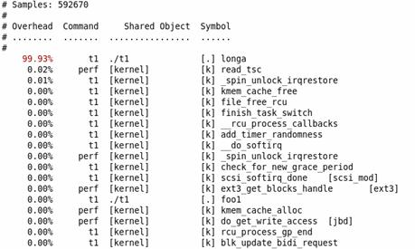
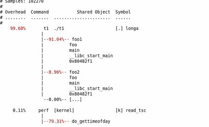

参考文章:
https://www.ibm.com/developerworks/cn/linux/l-cn-perf1/index.html
### 前置知识
##### 从 tick采样说起
性能调优工具如 perf，Oprofile 等的基本原理都是对被监测对象进行采样，最简单的情形是根据 tick 中断进行采样，即在 tick 中断内触发采样点，在采样点里判断程序当时的上下文。假如一个程序 90% 的时间都花费在函数 foo() 上，那么 90% 的采样点都应该落在函数 foo() 的上下文中。运气不可捉摸，但我想只要采样频率足够高，采样时间足够长，那么以上推论就比较可靠。因此，通过 tick 触发采样，我们便可以了解程序中哪些地方最耗时间，从而重点分析。当然使用tick通过的是概率事件,我们需要足够长的采样时间,perf 支持多种采样事件

#####  perf 中能够触发采样的事件有哪些。
```bash
perf list
```

list 非常长，只列举其中几种
```bash
$ perf list 
 List of pre-defined events (to be used in -e): 
 cpu-cycles OR cycles [Hardware event] 
 instructions [Hardware event] 
…
 cpu-clock [Software event] 
 task-clock [Software event] 
 context-switches OR cs [Software event] 
…
 ext4:ext4_allocate_inode [Tracepoint event] 
 kmem:kmalloc [Tracepoint event] 
 module:module_load [Tracepoint event] 
 workqueue:workqueue_execution [Tracepoint event] 
 sched:sched_{wakeup,switch} [Tracepoint event] 
 syscalls:sys_{enter,exit}_epoll_wait [Tracepoint event] 
…
```

* Hardware Event 是由 PMU 硬件产生的事件，比如 cache 命中，当您需要了解程序对硬件特性的使用情况时，便需要对这些事件进行采样；
* Software Event 是内核软件产生的事件，比如进程切换，tick 数等 ;
* Tracepoint event 是内核中的静态 tracepoint 所触发的事件，这些 tracepoint 用来判断程序运行期间内核的行为细节，比如 slab 分配器的分配次数等。

当我们使用perf -e 来指定事件时,**最常用的是 cycles 和 cpu-clock**
cpu-clock可以用来表示程序执行经过的真实时间，而无论CPU处于什么状态（Pn（n非0）或者是C状态);
而CPU cycles则用来表示执行程序指令花费的时钟周期数，如果CPU处于Pn（n非0）或者是C状态，则cycles的产生速度会减慢。
即，如果你想查看哪些代码消耗的真实时间多，则可以使用cpu-clock事件；而如果你想查看哪些代码消耗的时钟周期多，则可以使用CPU cycles事件。


### 使用教程
使用perf 时,建议先从整体上定位到程序的瓶颈在哪,比如这个程序是CPU密集型 (CPU bound )还是 IO密集型 (IO bound)
#### Perf stat
man 手册的解释
> Run a command and gather performance counter statistics

使用 perf stat 可以先看看程序总体的运行情况,我们不应该急于深入细节
下面从一个例子入手，学习 perf 的使用
```cpp
//test.c 
void longa() 
{ 
  int i,j; 
  for(i = 0; i < 1000000; i++) 
  j=i; //am I silly or crazy? I feel boring and desperate. 
} 
 
void foo2() 
{ 
  int i; 
  for(i=0 ; i < 10; i++) 
       longa(); 
} 
 
void foo1() 
{ 
  int i; 
  for(i = 0; i< 100; i++) 
     longa(); 
} 
 
int main(void) 
{ 
  foo1(); 
  foo2(); 
}
```
找到这个程序的性能瓶颈无需任何工具，肉眼的阅读可以知道 Longa() 是这个程序的瓶颈，只要提高它的速度，就可以极大地提高整个程序的运行效率。

我们现在将上面的例子编译成可执行文件
```bash
gcc – o t1 – g test.c
```
用 perf stat 运行它，通常使用perf 需要 root 权限
```bash
$sudo perf stat ./t1 
 Performance counter stats for './t1': 
 
 262.738415 task-clock-msecs # 0.991 CPUs 
 2 context-switches # 0.000 M/sec 
 1 CPU-migrations # 0.000 M/sec 
 81 page-faults # 0.000 M/sec 
 9478851 cycles # 36.077 M/sec (scaled from 98.24%) 
 6771 instructions # 0.001 IPC (scaled from 98.99%) 
 111114049 branches # 422.908 M/sec (scaled from 99.37%) 
 8495 branch-misses # 0.008 % (scaled from 95.91%) 
 12152161 cache-references # 46.252 M/sec (scaled from 96.16%) 
 7245338 cache-misses # 27.576 M/sec (scaled from 95.49%) 
 
  0.265238069 seconds time elapsed 
```
上面告诉我们，程序 t1 是一个 CPU bound 型，因为 task-clock-msecs 接近 1。

对 t1 进行调优应该要找到热点 ( 即最耗时的代码片段 )，再看看是否能够提高热点代码的效率

缺省情况下，除了 task-clock-msecs 之外，perf stat 还给出了其他几个最常用的统计信息：
* Task-clock-msecs：CPU 利用率，该值高，说明程序的多数时间花费在 CPU 计算上而非 IO。
* Context-switches：进程切换次数，记录了程序运行过程中发生了多少次进程切换，频繁的进程切换是应该避免的。
* Cache-misses：程序运行过程中总体的 cache 利用情况，如果该值过高，说明程序的 cache 利用不好
* CPU-migrations：表示进程 t1 运行过程中发生了多少次 CPU 迁移，即被调度器从一个 CPU 转移到另外一个 CPU 上运行。
* Cycles：处理器时钟，一条机器指令可能需要多个 cycles，
* Instructions: 机器指令数目。
* IPC：是 Instructions/Cycles 的比值，该值越大越好，说明程序充分利用了处理器的特性。
* Cache-references: cache 命中的次数
* Cache-misses: cache 失效的次数。

通过指定 -e 选项，您可以改变 perf stat 的缺省事件 (可通过 perf list 查看有哪些事件)

### perf top
> This command generates and displays a performance counter profile in real time.

Perf top 用于实时显示当前系统的性能统计信息。该命令主要用来观察整个系统当前的状态，比如可以通过查看该命令的输出来查看当前系统最耗时的内核函数或某个用户进程。
注意这里检查的是不同的进程,而非同一个进程内部的线程
假设有一个进程 t2,内部有一个死循环
```cpp
while (1) i++;
```

使用
```
sudo perf top  #需要root权限
```
可能看到的结果如下:
```bash
PerfTop: 705 irqs/sec kernel:60.4% [1000Hz cycles] 
-------------------------------------------------- 
sampl pcnt function DSO 
1503.00 49.2% t2 
72.00 2.2% pthread_mutex_lock /lib/libpthread-2.12.so 
68.00 2.1% delay_tsc [kernel.kallsyms] 
55.00 1.7% aes_dec_blk [aes_i586] 
55.00 1.7% drm_clflush_pages [drm] 
52.00 1.6% system_call [kernel.kallsyms] 
49.00 1.5% __memcpy_ssse3 /lib/libc-2.12.so 
48.00 1.4% __strstr_ia32 /lib/libc-2.12.so 
46.00 1.4% unix_poll [kernel.kallsyms] 
42.00 1.3% __ieee754_pow /lib/libm-2.12.so 
41.00 1.2% do_select [kernel.kallsyms] 
40.00 1.2% pixman_rasterize_edges libpixman-1.so.0.18.0 
37.00 1.1% _raw_spin_lock_irqsave [kernel.kallsyms] 
36.00 1.1% _int_malloc /lib/libc-2.12.so 
```
很容易便发现 t2 是需要关注的可疑程序。不过其作案手法太简单：肆无忌惮地浪费着 CPU。所以我们不用再做什么其他的事情便可以找到问题所在
通过添加 -e 选项，您可以列出造成其他事件的 TopN 个进程 / 函数。比如 -e cache-miss，用来看看谁造成的 cache miss 最多。

#### 使用 perf record, 解读 report
perf stat 和 perf top 只是帮我们从整体上了解了一个程序的瓶颈在哪,现在我们需要粒度更细的信息.使用 perf record 可以记录单个函数级别的统计信息，并使用 perf report 来显示统计结果。

调优应该将注意力集中到百分比高的热点代码片段上，假如一段代码只占用整个程序运行时间的 0.1%，即使您将其优化到仅剩一条机器指令，恐怕也只能将整体的程序性能提高 0.1%。

仍以前面的 t1 为例。
```bash
perf record – e cpu-clock ./t1
perf report
```

很容易发现 longa 就是那个占用性能的对象,当然事实上要优化的也不一定是 longa ,也可以是频繁调用了 longa 的foo1 或 foo2,这里 foo1 和 foo2 并没有显示. 显然我们需要找到频繁调用 foo1 的原因
我们可以添加一个 -g 参数,这也是经常要添加的参数,启用它可以记录函数的调用堆栈,即可以看到上一级有哪些线程调用了该函数,及调用了该函数的那些线程之间占比是多少
**注意!为了能够分析调用栈,在编译时请不要用 O2 优化而是使用 O0,否则在显示调用栈的时候由于优化很多函数名都显示不了,只能看见函数地址**
```bash
perf record – e cpu-clock – g ./t1 
perf report
```


很好,这样foo1 和 foo2 就被找到了!

#### 使用 perf 分析服务器性能
服务器不似上面的可执行文件,有一个开始和结束,一些服务器可能还是多个不同进程运行的, perf 支持我们检测线上运行的进程,只要我们获取到正在运行的进程的进程号
```bash
perf record –e cycles –g –p 进程号
```
-e 指定事件
-p 或 --pid 可以指定进程号,因此我们可以用
```bash
ps -ef | grep 进程名字
```
找到服务器进程的进程号,接着就可以在使用 perf stat 或 perf record 等命令时 使用 -p 来检测指定进程了

cycles 是执行指令花费的时钟周期数,某线程cycles值大则说明程序运行时有较多时间再执行该线程

-g 是记录函数的调用栈,即除了显示某个函数的CPU使用率,还可以查看是上一层有哪些函数调用了该函数及其比例
**注意!为了能够分析调用栈,在编译时请不要用 O2 优化而是使用 O0,否则在显示调用栈的时候由于优化很多函数名都显示不了,只能看见函数地址**


使用perf 检测指定进程时,如果程序运行没有结束,那么默认数据就会一直采集,直到进程结束,因此在服务器性能测试时,使用perf 检测数据一段时间后,要使用ctrl+c中断性能数据采集,如果是 perf stat 那么中断时就会打印结果,如果是 perf record,则在当前目录生成perf.data性能数据文件。

在调试spp程序时,一般我们会开多个worker进程,如果请求量不大,我们可以把worker进程设成一个( 配置文件中worker的procnum 设为1,如果配置里指定了多个worker,其它worker 的procnum设为0),如果请求量非常大,那么进程过少会导致过载,程序无法正常运行  

只有一个worker进程出现过载时,可以增大进程个数,但同时要确保进程数尽可能最少,这样才能使得每个worker进程都能充分占用CPU,这样我们就可以使用 perf 	去监控一个worker了,当然有时监控一个worker并不准确,因为这个worker可能配分摊到的任务很少,我们可以先用 perf stat 去看哪个worker 占用CPU较多,然后用perf去检测它; 当然还可以用 perf 分别检测每个worker,然后做出决断

#### 结果分析
前面已经初次见过使用 perf report 分析结果了，这也是最常用的分析手法，对于生成的perf.data,可以用其他工具,如 dot perftools (pprof)来分析,这里不详细展开
#### perf report
perf report默认会读取当前目录下perf.data文件，如果想要分析的性能数据文件不在当前目录下，可用 -i 参数指定文件路径。
perf report -i ./perf.data