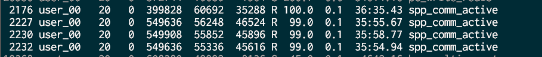
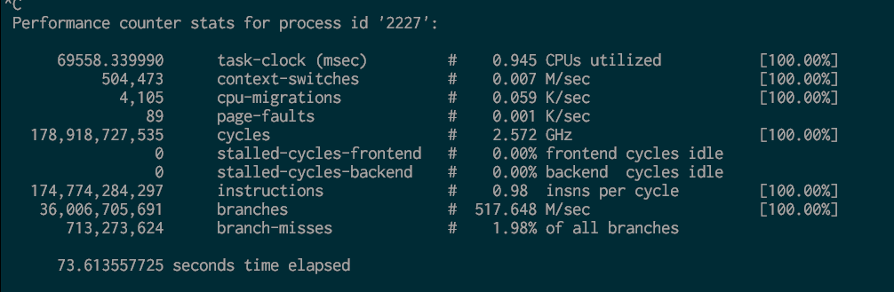
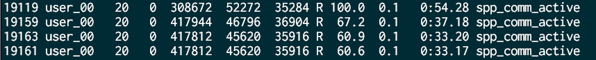
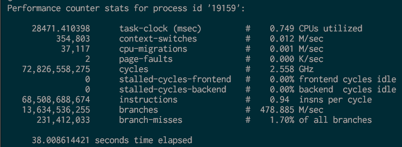

#### 记一次通用活动系统的测试
如何使用perf这里不介绍,请看另一篇文章,定位问题时,把编译选项改为 O0,才能够确保符号不会被优化掉,这样才能用 perf 的 -g 参数查看调用栈

##### 优化前
为了让每个 worker 分摊到尽可能多的任务，我讲procnum 设置为 3 （设置为0时会过载）
top 命令粗略查看

perf stat -p 其中一个worker进程

##### 优化后
top 命令粗略查看

CPU 占用率有明显下降

perf stat -p 其中一个worker进程

还是看 task-clock(mesc) 项，CPU 占用率(其实和top是一个意思)，下降明显