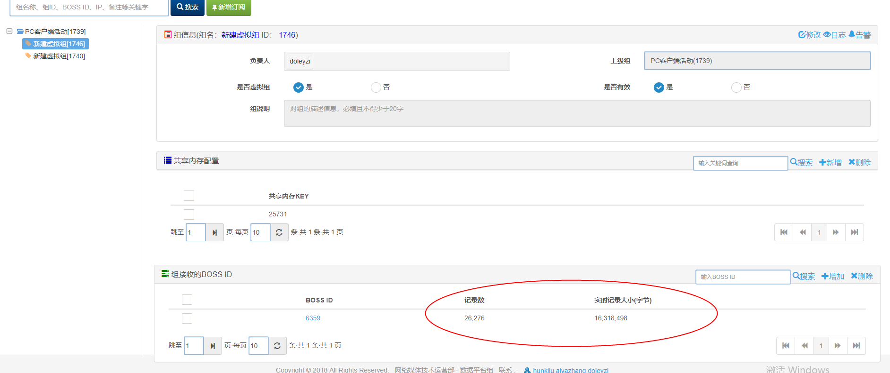

如果有数据推送到我们的服务器
那么就会记录数就不会为0, 若为0,找客户端或前端


### 数据订阅
#### 使用boss 库时可能遇到的问题
```bash
/usr/bin/ld: /usr/local/commlib/platformlib/boss_bus/lib//libbossbus.a(boss_bus.o): relocation R_X86_64_32 against `.bss' can not be used when making a shared object; recompile with -fPIC
/usr/local/commlib/platformlib/boss_bus/lib//libbossbus.a: could not read symbols: Bad value
```
原因是公司开发机上的boss库并不支持动态符号链接,我们需要找一个编译时选择支持动态链接的库
解决办法:
到:
http://km.oa.com/group/24675/articles/show/342809?kmref=search&from_page=1&no=1
的附件下载 boss_bus.tar.gz 里面有 boss库的头文件和库文件,里面的库文件是可用的

### 数据上报
各种上报 api 网址
http://boss.webdev.com/items/wiki/doku.php?id=%E8%9C%82%E5%B7%A2_%E5%89%8D%E5%8F%B0%E6%8E%A5%E5%85%A5_%E4%B8%8A%E6%8A%A5%E6%8C%87%E5%8D%97&#%E5%85%B6%E4%BB%96

##### 可能的问题
python api 有个坑,下载的包是 .tar.gz 后缀的,用 tar xzf 解压会出错,在windows上解压后才知道这是 .tar 文件,解决办法是在windows把包解了,重新压缩回正确地格式再上传